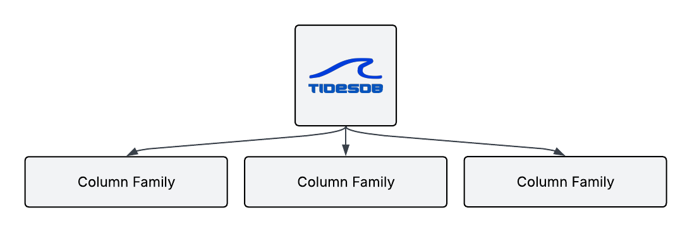
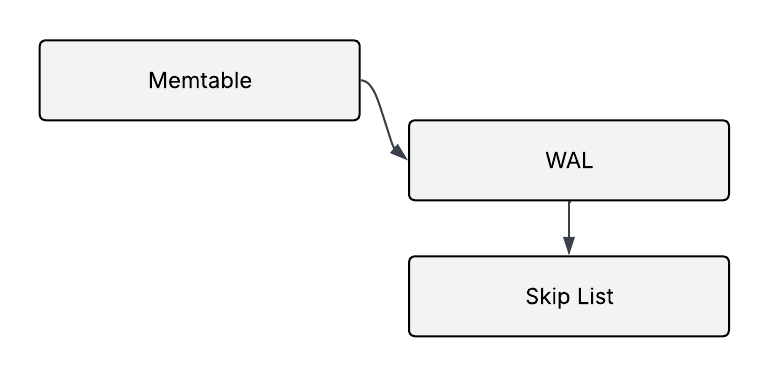
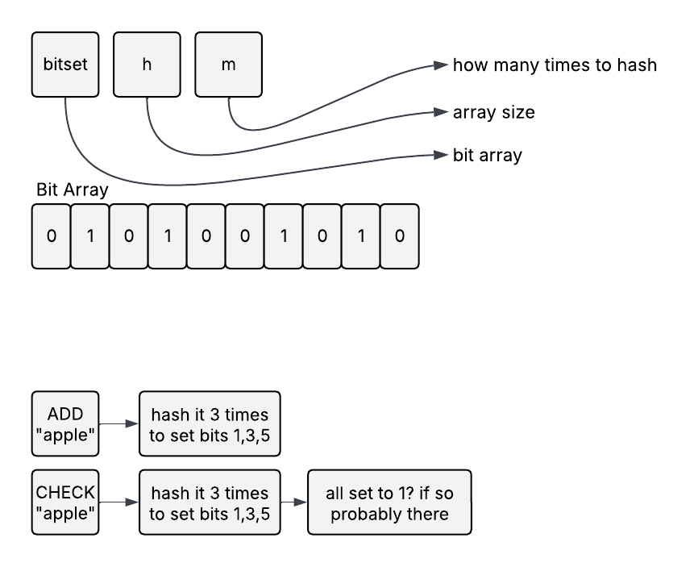
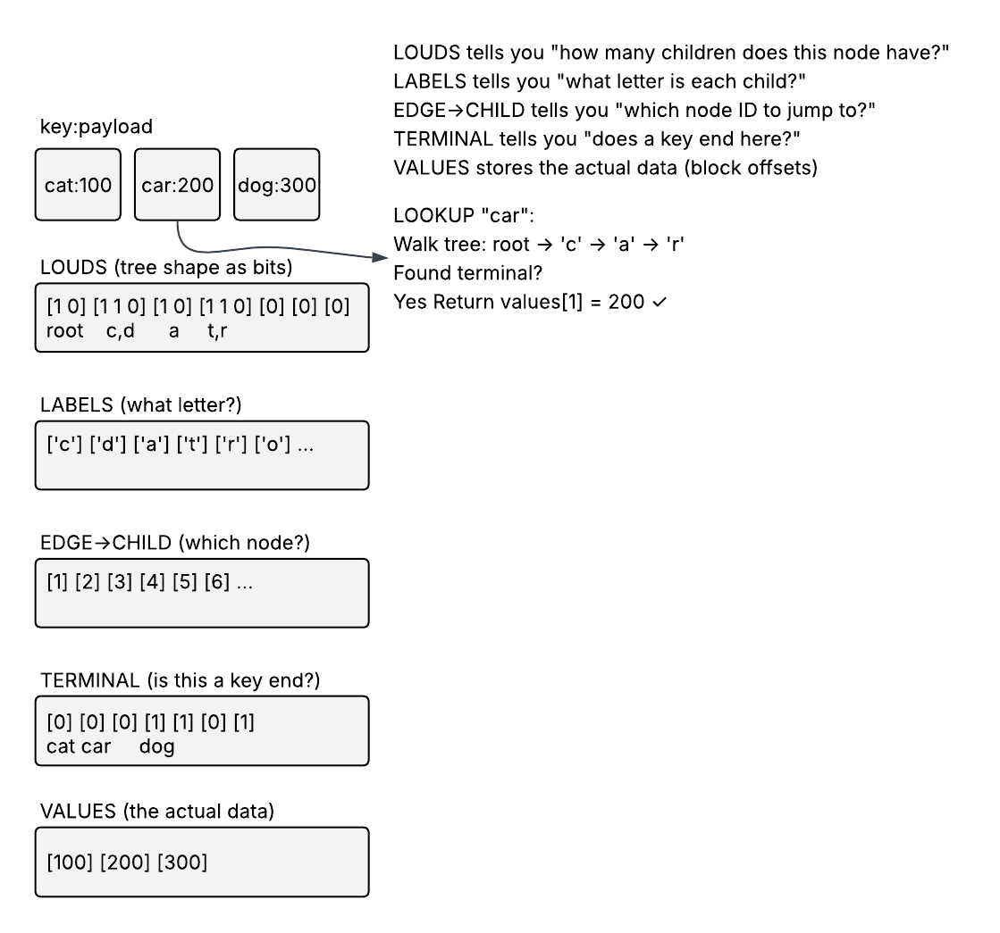
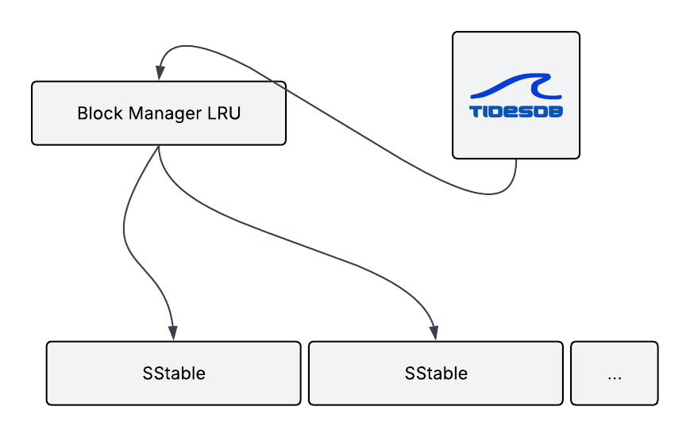
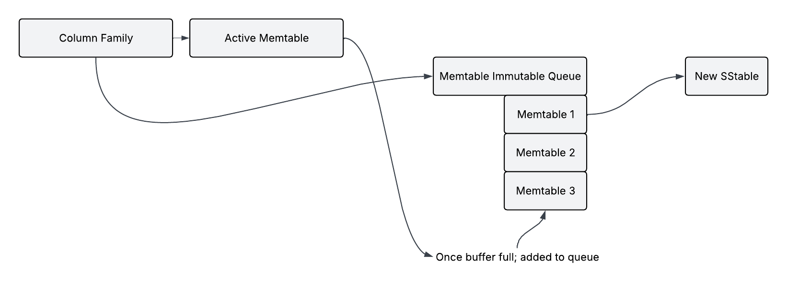

## 1. Introduction
Here we explore the inner workings of TidesDB, its architecture, core components, and operational mechanisms.

## 2. Theoretical Foundation
### 2.1 Origins and Concept
The Log-Structured Merge-tree was first introduced by Patrick O'Neil, Edward Cheng, Dieter Gawlick, and Elizabeth O'Neil in their 1996 paper. The fundamental insight of the LSM-tree is to optimize write operations by using a multi-tier storage structure that defers and batches disk writes.

### 2.2 Basic LSM-tree Structure
An LSM-tree typically consists of multiple components

- In-memory buffers (memtables) that accept writes
- Immutable on-disk files (SSTables are Sorted String Tables)
- Processes that merge SSTables to reduce storage overhead and improve read performance

This structure allows for efficient writes by initially storing data in memory and then periodically flushing to disk in larger batches, reducing the I/O overhead associated with random writes.


## 3. TidesDB Architecture

### 3.1 Overview

TidesDB implements a Log-Structured Merge-tree storage engine with a multi-level architecture designed for high-throughput concurrent operations. The system organizes data through a hierarchical structure consisting of volatile memory components, persistent write-ahead logs, and tiered immutable disk storage, with all operations coordinated through lock-free atomic primitives and carefully synchronized background worker threads.

At the storage engine level, TidesDB maintains a central database instance (`tidesdb_t`) that coordinates multiple independent column families, each functioning as an isolated key-value namespace with dedicated storage structures and configurable operational parameters. The database instance manages shared infrastructure including engine-level thread pools for flush and compaction operations, a global SSTable structure cache implemented with LRU eviction policy, an optional lock-free global block cache for decompressed klog and vlog blocks, and recovery synchronization primitives that ensure crash-safe initialization. Column families are organized in a dynamically resizable array protected by a reader-writer lock (`cf_list_lock`), enabling concurrent read access to the column family list while serializing structural modifications during column family creation and deletion operations.

Each column family (`tidesdb_column_family_t`) maintains its own independent LSM-tree structure consisting of three primary storage tiers. The memory tier contains an active memtable implemented as a lock-free skip list with atomic reference counting, paired with a dedicated write-ahead log (WAL) file for durability. When the active memtable reaches a configurable size threshold, it transitions to an immutable state and is enqueued in the immutable memtables queue while a new active memtable is atomically swapped into place. The disk tier organizes SSTables into multiple levels, with each level maintaining a dynamically sized array of SSTable pointers protected by a reader-writer lock (`levels_lock`). Level 0 contains recently flushed SSTables in arbitrary order, while subsequent levels maintain sorted, non-overlapping key ranges with exponentially increasing capacity determined by a configurable size ratio. This multi-level organization enables efficient range queries and predictable compaction behavior as data ages through the storage hierarchy.

Background operations are coordinated through engine-level thread pools rather than per-column-family threads, providing superior resource utilization and consistent performance characteristics across the entire database instance. The flush thread pool processes memtable-to-SSTable flush operations submitted from any column family, while the compaction thread pool handles SSTable merge operations across all levels. Worker threads in both pools execute a blocking dequeue pattern, waiting efficiently on task queues until work arrives, then processing tasks to completion before returning to the wait state. This architecture decouples application write operations from background I/O, enabling sustained write throughput independent of disk performance while maintaining bounded memory usage through flow control mechanisms.

Crash recovery and initialization follow a strictly ordered sequence designed to prevent race conditions between recovery operations and background worker threads. During database open, the system first creates background worker threads for flush and compaction operations, but these threads immediately block on a recovery condition variable before processing any work. Database recovery then proceeds with exclusive access to all data structures: scanning the database directory for column family subdirectories, reconstructing column family metadata from persisted configuration files, discovering WAL files and SSTables, and loading SSTable metadata (min/max keys, bloom filters, block indices) into memory. For each WAL file discovered, the system replays entries into a new memtable using the skip list's version chain mechanism, then enqueues the recovered memtable as immutable for background flush. After all column families are recovered, the system signals the recovery condition variable, unblocking worker threads to begin processing the queued flush tasks asynchronously. Recovered memtables remain accessible for reads while being flushed in the background, with the immutable memtable queue serving as a searchable tier in the read path. This design guarantees that all persisted data is accessible and all data structures are consistent before background operations commence, ensuring correctness in the presence of crashes, incomplete writes, or corrupted data files.

The read path implements a multi-tier search strategy that prioritizes recent data over historical data, ensuring that the most current version of any key is always retrieved. Queries first examine the active memtable using lock-free atomic operations, then proceed through immutable memtables in the flush queue in reverse chronological order, and finally search SSTables within each level from newest to oldest. SSTable lookups employ multiple optimization techniques including min/max key range filtering to skip irrelevant files, probabilistic bloom filter checks to avoid disk I/O for non-existent keys, and optional succinct trie block indices that enable direct block access without linear scanning. This hierarchical search pattern, combined with atomic reference counting on all data structures, enables lock-free concurrent reads that scale linearly with CPU core count while maintaining strong consistency guarantees and read-your-own-writes semantics within transactions.

### 3.2 Column Families

TidesDB organizes data into column families, a design pattern that provides namespace isolation and enables independent configuration of storage and operational parameters for different data domains within a single database instance. Each column family (`tidesdb_column_family_t`) functions as a logically independent LSM-tree with its own complete storage hierarchy, from volatile memory structures through persistent disk storage, while sharing the underlying engine infrastructure for resource efficiency.

<div class="architecture-diagram">



</div>

A column family maintains complete storage isolation through dedicated data structures at each tier of the LSM hierarchy. The memory tier consists of an atomically-swapped active memtable pointer, a monotonically increasing memtable generation counter for versioning, an active WAL file handle, and a queue of immutable memtables awaiting flush. The disk tier organizes SSTables into a dynamically allocated array of levels, with each level protected by a reader-writer lock that enables concurrent reads while serializing structural modifications during compaction. Sequence number generation occurs independently per column family through atomic increment operations, ensuring that transaction ordering within a column family remains consistent while allowing concurrent operations across different column families to proceed without coordination overhead.

Configuration parameters are specified per column family at creation time and persisted to disk in INI format within the column family's directory. These parameters control fundamental operational characteristics including memtable flush thresholds that determine memory-to-disk transition points, skip list structural parameters (maximum level and probability) that affect search performance, compression algorithms and settings that balance CPU utilization against storage efficiency, bloom filter configuration including false positive rates, block index enablement for direct block access, and compaction policies including automatic background compaction triggers and thread allocation. Once a column family is created, certain parameters such as the key comparator function become immutable for the lifetime of the column family, ensuring consistent sort order across all storage tiers and preventing data corruption from comparator changes.

Concurrency control within a column family employs a hybrid approach that combines lock-free atomic operations for high-frequency read and write paths with mutex-based coordination for infrequent structural operations. The active memtable skip list uses lock-free Compare-And-Swap (CAS) operations for all insertions and lookups, enabling unlimited concurrent readers and writers without contention. Structural operations that modify the storage hierarchy acquire dedicated mutexes: the flush lock (`flush_lock`) serializes memtable rotation and flush queue modifications, while the compaction lock (`compaction_lock`) serializes SSTable array updates during merge operations. The levels lock (`levels_lock`) implements reader-writer semantics, allowing multiple concurrent readers to traverse the SSTable hierarchy while ensuring exclusive access during level modifications. This design ensures that common-case operations (reads and writes) proceed without blocking while maintaining correctness during structural changes.

Column families enable domain-specific optimization strategies within a single database instance. High-throughput write-heavy workloads can configure large memtable sizes and aggressive compression to maximize write batching and minimize disk I/O. Read-heavy workloads can enable bloom filters and block indices to accelerate lookups at the cost of additional storage overhead. Temporary or cache-like data can disable durability features (TDB_SYNC_NONE) and use minimal compression for maximum performance, while critical persistent data can enable full synchronous writes (TDB_SYNC_FULL) and strong compression for maximum reliability. This flexibility allows applications to co-locate diverse data types with different performance and durability requirements within a single storage engine instance, simplifying operational management while maintaining optimal performance characteristics for each data domain.

## 4. Core Components and Mechanisms
### 4.1 Memtable
<div class="architecture-diagram">



</div>

The memtable is the first landing point for all column family write operations. TidesDB implements the memtable using a lock-free skip list with atomic operations and a versioning strategy for exceptional read performance. When a key is updated, a new version is prepended to the version list for that key, but reads always return the newest version (head of the list), implementing **last-write-wins** semantics. This allows concurrent reads and writes without blocking.

**Lock-Free Concurrency Model**

Readers never acquire locks, never block, and scale linearly with CPU cores. Writers perform lock-free atomic operations on the skip list structure using CAS (Compare-And-Swap) instructions. Readers don't block writers, and writers don't block readers. All read operations use atomic pointer loads with acquire memory ordering for correct synchronization. Flush and compaction operations use dedicated mutexes (`flush_lock` and `compaction_lock`) to serialize structural changes without blocking skip list operations.

**Memory Management**

- Skip list nodes are allocated individually using `malloc()` for each node
- Keys are always allocated separately and stored as pointers in nodes
- Values are allocated separately and stored in version structures
- Each key can have multiple versions linked in a list, with the newest version at the head
- Reads always return the newest version (last-write-wins semantics)
- Nodes are freed only when the entire skip list is destroyed (via `skip_list_free` or `skip_list_clear`)
- Memtables use atomic reference counting to prevent premature freeing during concurrent access

**Custom Comparators**

Each column family can register a custom key comparison function (memcmp, string, numeric, or user-defined) that determines sort order consistently across the entire system--memtable, SSTables, block indexes, and iterators all use the same comparison logic.  Once a comparator is registered, it cannot be changed for the duration of the column family's lifecycle.

**Configuration and Lifecycle**

The skip list's flush threshold (`write_buffer_size`), maximum level, and probability parameters are configurable per column family. When the memtable reaches the size threshold, it becomes immutable and is queued for flushing while a new active memtable is created. The immutable memtable is flushed to disk as an SSTable (klog and vlog files) by a background thread pool, with reference counting ensuring the memtable isn't freed until all readers complete and the flush finishes. Each memtable is paired with a WAL (Write-Ahead Log) for durability and recovery. When a memtable is in the flush queue and immutable it is still accessible for reading. Because the memtable has a WAL associated with it, you will see a WAL file (e.g., wal_4.log) until the flush is complete. If a crash occurs, the memtable's WAL is replayed using skip list version chains to reconstruct the memtable state, then the recovered memtable is enqueued as immutable for background flush.


### 4.2 Block Manager Format

The block manager is TidesDB's low-level storage abstraction that manages both WAL files and SSTable files. All persistent data is stored using the block manager format.

#### File Structure

Every block manager file (WAL or SSTable) has the following structure

```
[File Header is 12 bytes]
[Block 0]
[Block 1]
[Block 2]
...
[Block N]
```

#### File Header (12 bytes)

| Offset | Size | Field | Description |
|--------|------|-------|-------------|
| 0 | 3 bytes | Magic | `0x544442` ("TDB" in hex) |
| 3 | 1 byte | Version | Block manager version |
| 4 | 4 bytes | Block Size | Default block size for this file |
| 8 | 4 bytes | Padding | Reserved for future use |


#### Block Format

Each block has the following structure

```
[Block Size is 8 bytes (uint64_t)]
[xxHash64 Checksum is 8 bytes]
[Inline Data is a variable, up to block_size]
[Overflow Offset is 8 bytes (uint64_t)]
[Overflow Data is a variable, if size > block_size]
```

**Block Header (24 bytes minimum)**

The block header consists of the block size (8 bytes) representing the total size of the data (inline + overflow), an xxHash64 checksum (8 bytes) for integrity checking the entire block data, inline data (variable) containing the first portion of data up to `block_size` bytes, and an overflow offset (8 bytes) pointing to overflow data (0 if no overflow).

**Overflow Handling**

If the data size is less than or equal to `block_size` (default 32KB), all data is stored inline with overflow offset set to 0. If the data size exceeds `block_size`, the first 32KB is stored inline and the remainder is placed at the overflow offset. Overflow data is written immediately after the main block, allowing efficient storage of both small and large blocks.

#### Block Write Process

The write process begins by computing the xxHash64 checksum of the entire data, determining the inline size (minimum of data size and block_size), and calculating the remaining overflow size. The main block buffer is built containing the block size (8 bytes), xxHash64 checksum (8 bytes), inline data (up to 32KB), and overflow offset (8 bytes, initially 0). The main block is written atomically using `pwrite()`. If overflow exists, the overflow data is written at the end of the file and the overflow offset in the main block is updated. Finally, fsync is optionally performed based on the sync mode.

#### Block Read Process

The read process reads the block size (8 bytes) and xxHash64 checksum (8 bytes), calculates the inline size, and reads the inline data. It then reads the overflow offset (8 bytes). If the overflow offset is greater than 0, it seeks to the overflow offset and reads the remaining data. The inline and overflow data are concatenated, the xxHash64 checksum is verified, and the block is returned if valid.

#### Integrity and Recovery

TidesDB implements multiple layers of data integrity protection. All block 
reads verify xxHash64 checksums to detect corruption, while writes use `pwrite()` 
for atomic block-level updates. During startup, the system validates the last 
block's integrity--if corruption is detected, the file is automatically 
truncated to the last known-good block. This approach ensures crash safety by 
guaranteeing that incomplete or corrupted writes are identified and cleaned up 
during recovery.

#### Cursor Operations

The block manager provides cursor-based sequential access for efficient data 
traversal. Cursors support forward iteration via `cursor_next()` and backward 
iteration through `cursor_prev()`, which scans from the beginning to locate 
the previous block. Random access is available through `cursor_goto(pos)`, 
allowing jumps to specific file offsets. Each cursor maintains its current 
position and block size, with boundary checking methods like `at_first()`, 
`at_last()`, `has_next()`, and `has_prev()` to prevent out-of-bounds access.

#### Sync Modes

TDB_SYNC_NONE provides the fastest performance with no explicit fsync, relying on the OS page cache. TDB_SYNC_FULL offers the most durability by performing fsync/fdatasync after every block write. The sync mode is configurable per column family and set internally for column family WAL and SSTable files.

#### Thread Safety

Block manager operations use a write mutex to serialize all write operations, preventing corruption. Concurrent reads are supported with multiple readers able to read simultaneously using `pread()`. All writes use `pwrite()` for atomic operations.

#### Lock-Free LRU Block Cache

TidesDB implements an optional lock-free LRU (Least Recently Used) block cache at the engine level to reduce disk I/O for frequently accessed data blocks. This cache is **global and shared across all column families**, configured via the `block_cache_size` setting in the database configuration. The shared design enables efficient memory utilization and cross-CF cache hits when the same blocks are accessed by different column families.

**Cache Architecture**

The block cache uses a lock-free hash table with atomic operations for concurrent access without mutexes. Each cache entry includes the decompressed block data, size, and atomic access timestamp for LRU ordering. The cache maintains an atomic size counter tracking total cached bytes and enforces a maximum size limit through atomic compare-and-swap operations. Cache keys are composite identifiers combining column family name, SSTable ID, block type (klog/vlog), and file offset, enabling fine-grained caching across the entire database while preventing collisions between different CFs.

**Cache Operations**

After reading a block from disk and decompressing it, the system attempts to add it to the cache using atomic operations. If cache space is available, the block is inserted with an atomic timestamp marking the access time. If the cache is full, the LRU eviction policy scans entries to find the least recently used block (oldest timestamp) and atomically removes it to make space. All cache operations use atomic CAS to prevent race conditions during concurrent access from multiple column families.

Before reading from disk, the cache is checked using the composite key. On cache hit, the block's access timestamp is atomically updated to mark it as recently used, and a copy of the cached block is returned immediately (no disk I/O). On cache miss, the block is read from disk, decompressed, and added to the cache if space permits. The LRU policy ensures frequently accessed blocks remain in cache while cold data is automatically evicted, with the global cache naturally prioritizing hot data across all column families.

When the cache reaches `block_cache_size`, the LRU eviction algorithm scans entries to find candidates with the oldest access timestamps. The eviction callback atomically decrements the size counter and frees the block's memory. This lock-free design enables concurrent cache access from multiple threads and column families without contention, maximizing throughput for read-heavy workloads.

**Configuration Example**

```c
tidesdb_config_t config = {
    .db_path = "./mydb",
    .block_cache_size = 64 * 1024 * 1024,  /* 64MB global cache shared across all CFs */
    .max_open_sstables = 100,
    .num_flush_threads = 4,
    .num_compaction_threads = 8
};
tidesdb_t *db;
tidesdb_open(&db, &config);
```

**Performance Benefits**

- Hot blocks (frequently accessed) stay in memory, eliminating disk reads
- Cache hits provide sub-microsecond access vs milliseconds for disk I/O
- During compaction, recently written blocks are cached, speeding up merge operations
- Sequential scans benefit from cached blocks in the read path

**Cache Sizing Guidelines**

- Small datasets (<100MB): Set cache to 10-20% of total dataset size across all CFs
- Large datasets (>1GB): Set cache to 5-10% or based on working set size
- Read-heavy workloads: Larger cache (64-256MB+) provides better hit rates
- Write-heavy workloads: Smaller cache (16-32MB) since data is less frequently re-read
- Multi-CF workloads: Size based on combined working set of all active CFs
- Disable caching: Set `block_cache_size = 0` to disable (no memory overhead)

**Monitoring Cache Effectiveness**

While TidesDB doesn't expose cache hit/miss metrics directly, you can infer effectiveness by monitoring I/O patterns (fewer disk reads indicate good cache performance) and adjusting cache size based on workload (increase if reads are slow, decrease if memory is constrained).


### 4.3 SSTables (Sorted String Tables)

SSTables serve as TidesDB's immutable on-disk storage layer, implementing a key-value separation architecture where keys and values are stored in distinct files. Each SSTable consists of two block manager files: a klog (key log) containing sorted keys with metadata and small inline values, and a vlog (value log) containing large values referenced by offset from the klog. This separation enables efficient key-only operations such as bloom filter construction, block index building, and range scans without loading large values into memory. The immutable nature of SSTables--once written, they are never modified, only merged or deleted--ensures data consistency and enables lock-free concurrent reads.

**File Naming and Level Organization**

SSTable files follow the naming convention `L<level>_<id>.klog` and `L<level>_<id>.vlog`, where level indicates the LSM tree level (1-based in filenames, 0-based in array indexing) and id is a monotonically increasing counter per column family. For example, `L1_0.klog` and `L1_0.vlog` represent the first SSTable at level 1, stored in `levels[0]` of the in-memory array. During recovery, the system parses the level number from filenames and maps `L<N>` files to `levels[N-1]`, ensuring correct placement in the LSM hierarchy. This naming scheme enables efficient level-based compaction and provides clear visibility into the storage organization on disk.

**Reference Counting and Lifecycle**

SSTables use atomic reference counting to manage their lifecycle safely. When an SSTable is accessed (by a read operation, iterator, or compaction), its reference count is incremented via `tidesdb_sstable_ref`. When the operation completes, the reference is released via `tidesdb_sstable_unref`. Only when the reference count reaches zero is the SSTable actually freed from memory and its file handles closed. This prevents use-after-free bugs during concurrent operations like compaction (which may delete SSTables) and reads (which may still be accessing them). The reference counting mechanism integrates with the SSTable cache, ensuring that cached SSTables remain valid while in use.

**SSTable Caching**

The storage engine maintains an LRU (Least Recently Used) cache of SSTable structures at the engine level, configured via `max_open_sstables` (default 100). When an SSTable is accessed, the system first checks the cache using a composite key of `<cf_name>:<sstable_id>`. On cache hit, the cached SSTable structure is returned with its reference count incremented. On cache miss, the SSTable is loaded from disk (opening both klog and vlog block managers), added to the cache, and returned. When the cache reaches capacity, the least recently used SSTable is evicted, triggering closure of its block manager file handles. This caching strategy prevents file descriptor exhaustion while maintaining good performance for frequently accessed SSTables, with the LRU policy ensuring hot data remains in memory.

#### SSTable Block Layout

SSTables use the block manager format with key-value separation across two files:

**Klog File (L<level>_<id>.klog) - Keys and Metadata**
```
[File Header - 12 bytes Block Manager Header]
[Block 0: Klog Block with N entries]
[Block 1: Klog Block with M entries]
...
[Block K: Last Klog Block]
[Bloom Filter Block] (optional)
[Index Block] (optional)
[Metadata Block] (always last)
```

**Vlog File (L<level>_<id>.vlog) - Large Values**
```
[File Header - 12 bytes Block Manager Header]
[Block 0: Vlog Block with N values]
[Block 1: Vlog Block with M values]
...
[Block V: Last Vlog Block]
```

**Klog Block Order (from first to last)**
1. Data Blocks: Klog blocks containing multiple key entries in sorted order, with inline values below threshold or vlog offsets for large values
2. Bloom Filter Block (optional): Only written if `enable_bloom_filter = 1`
3. Index Block (optional): Only written if `enable_block_indexes = 1`
4. Metadata Block (required): Always the last block, contains min/max keys, entry count, and file offsets

**Value Threshold and Separation**

Values smaller than or equal to `value_threshold` (default 1KB) are stored inline within klog entries, enabling single-file access for small key-value pairs. Values exceeding the threshold are written to the vlog file, with the klog entry storing only the vlog offset. This separation optimizes for the common case where most values are small while efficiently handling large values without bloating the klog. During recovery, the system reads backwards from the klog end: metadata (last), then index (if present), then bloom filter (if present), establishing the data end offset before loading entries.

#### Klog Block Format

Each klog block contains multiple key entries with a header specifying the count:

```
[Num Entries - 4 bytes (uint32_t)]
[Block Size - 4 bytes (uint32_t)]
[Entry 0: Klog Entry Header + Key + Inline Value (if present)]
[Entry 1: Klog Entry Header + Key + Inline Value (if present)]
...
[Entry N-1: Klog Entry Header + Key + Inline Value (if present)]
```

**Klog Entry Header (34 bytes, packed)**
```c
typedef struct __attribute__((packed)) {
    uint8_t version;        // Format version (currently 5)
    uint8_t flags;          // TDB_KV_FLAG_TOMBSTONE (0x01) for deletes
    uint32_t key_size;      // Key size in bytes
    uint32_t value_size;    // Actual value size in bytes
    int64_t ttl;            // Unix timestamp for expiration (0 = no expiration)
    uint64_t seq;           // Sequence number for ordering and MVCC
    uint64_t vlog_offset;   // Offset in vlog file (0 if value is inline)
} tidesdb_klog_entry_t;
```

**Entry Layout**

Each entry consists of the 34-byte header, followed by the key data, followed by the value data if inline (when `value_size <= value_threshold` and `vlog_offset == 0`). For large values, only the header and key are stored in the klog, with `vlog_offset` pointing to the value's location in the vlog file. This structure enables efficient key-only scans for operations like bloom filter checks and block index construction without loading large values.

**Vlog Block Format**

Vlog blocks contain multiple values referenced by klog entries:

```
[Num Values - 4 bytes (uint32_t)]
[Block Size - 4 bytes (uint32_t)]
[Value 0 Size - 4 bytes (uint32_t)]
[Value 0 Data - variable]
[Value 1 Size - 4 bytes (uint32_t)]
[Value 1 Data - variable]
...
```

**Compression**
- If compression is enabled in column family config, entire klog and vlog blocks are compressed independently
- Compression applied to the complete block (header + all entries) as a unit
- Supports Snappy, LZ4, or ZSTD algorithms (configured via `compression_algorithm`)
- Decompression happens on read before parsing block header and entries
- Default is enabled with LZ4 algorithm for balanced performance

#### Bloom Filter Block

<div class="architecture-diagram">



</div>

Written after all data blocks (if enabled)
- Serialized bloom filter data structure
- Used to quickly determine if a key might exist in the SSTable
- Avoids unnecessary disk I/O for non-existent keys
- False positive rate configurable per column family (default 1%)
- Only written if `enable_bloom_filter = 1` in column family config
- Loaded third-to-last when reading backwards during SSTable recovery

#### Index Block (Succinct Trie)

<div class="architecture-diagram">



</div>

TidesDB implements a space-efficient succinct trie using LOUDS (Level-Order Unary Degree Sequence) encoding to provide fast key-to-block-number lookups in SSTables. The data structure consists of five compact arrays that work in concert: a LOUDS bitvector that encodes the tree structure using approximately 2 bits per node, where sequences of 1-bits represent children and 0-bits mark boundaries; a labels array storing the character for each edge in breadth-first order; an edge_child array mapping each edge index to its corresponding child node ID; a terminal bitvector marking which nodes represent complete keys; and a values array holding the actual block numbers (0-indexed sequential positions) for terminal nodes. During lookup, the trie navigates from the root by using rank and select operations on the LOUDS bitvector to locate children, comparing characters in the labels array, and following the edge_child mappings until reaching a terminal node, at which point it returns the corresponding block number. The implementation features a disk-streaming builder that maintains O(1) memory usage during construction by writing intermediate data to temporary block manager files, making it capable of building indices for arbitrarily large datasets without memory constraints. This approach achieves 95% space savings compared to pointer-based tries while maintaining O(key_length) lookup time, and the entire structure can be serialized directly into SSTable files for persistent storage, enabling TidesDB to perform direct block access (by advancing the cursor to the returned block number) instead of expensive linear scans through data blocks.

#### Metadata Block

Always written as the last block in the file

```
[Magic is 4 bytes (0x5353544D = "SSTM")]
[Num Entries is 8 bytes (uint64_t)]
[Min Key Size is 4 bytes (uint32_t)]
[Min Key is variable]
[Max Key Size is 4 bytes (uint32_t)]
[Max Key is variable]
```

**Purpose**
- Magic number (0x5353544D = "SSTM") identifies this as a valid SSTable metadata block
- Min/max keys enable range-based SSTable filtering during reads
- Num entries tracks total KV pairs in SSTable (used to know when to stop reading data blocks)
- Always loaded first during SSTable recovery using `cursor_goto_last()` to read from end of file

#### SSTable Write Process

1. Create SSTable file and initialize bloom filter and succinct trie builder (if enabled)
2. Iterate through memtable in sorted order using skip list cursor
3. **For each KV pair**
   - Build KV header (26 bytes) + key + value
   - Optionally compress the entire block
   - Write as data block and record the block number (0-indexed sequential counter)
   - Add key to bloom filter (if enabled)
   - Add key->block_number mapping to succinct trie builder (if enabled)
   - Track min/max keys
4. Build the succinct trie from the builder (if enabled)
5. Serialize and write bloom filter block (if enabled)
6. Serialize and write succinct trie index block (if enabled)
7. Build and write metadata block with magic number, entry count, and min/max keys

#### SSTable Read Process

1. **Load SSTable** (recovery or cache miss)
   - Check engine-level SSTable LRU cache using composite key `<cf_name>:<sstable_id>`
   - On cache miss: open klog and vlog block manager files
   - Use `cursor_goto_last()` to seek to last klog block
   - Read and parse metadata block (validates magic number 0x5353544D)
   - Extract num_entries, min_key, and max_key from metadata
   - Use `cursor_prev()` to read previous block (index, if present)
   - Deserialize succinct trie index (if data is valid)
   - Use `cursor_prev()` to read previous block (bloom filter, if present)
   - Deserialize bloom filter (if data is valid)
   - Store SSTable structure in LRU cache with reference count = 1

2. **Lookup Key**
   - Acquire SSTable from cache (increment reference count)
   - Ensure klog and vlog block managers are open
   - Check if key is within min/max range using configured comparator (quick rejection)
   - Check bloom filter if enabled (probabilistic rejection)
   - If block indexes enabled: query succinct trie for block number (0-indexed)
     - Position cursor at first klog block, then advance to target block number
     - Read klog block at that position
   - If block indexes disabled: linear scan through klog data blocks
   - Decompress klog block if compression is enabled
   - Parse klog block header (num_entries, block_size)
   - Iterate through entries in the block:
     - Parse klog entry header (34 bytes): version, flags, key_size, value_size, ttl, seq, vlog_offset
     - Compare entry key with search key using comparator
     - If match found:
       - Check TTL expiration (return NOT_FOUND if expired)
       - Check tombstone flag (return NOT_FOUND if deleted)
       - If vlog_offset == 0: value is inline in klog, return it
       - If vlog_offset > 0: read value from vlog file at offset, decompress if needed, return it
   - Release SSTable reference (decrement reference count)
   - Return value or TDB_ERR_NOT_FOUND if not present

SSTables are cached in the engine-level LRU cache, with block managers kept open while the SSTable is cached. When evicted from cache, block managers are closed to prevent file descriptor exhaustion.
<div class="architecture-diagram">



</div>

### 4.4 Write-Ahead Log (WAL)
For durability, TidesDB implements a write-ahead logging mechanism with a rotating WAL system tied to memtable lifecycle.

#### 4.4.1 WAL File Naming and Lifecycle
<div class="architecture-diagram">

   
   
</div>

File Format: `wal_<memtable_id>.log`

WAL files follow the naming pattern `wal_0.log`, `wal_1.log`, `wal_2.log`, etc. Each memtable has its own dedicated WAL file, with the WAL ID matching the memtable ID (a monotonically increasing counter). Multiple WAL files can exist simultaneously - one for the active memtable and others for memtables in the flush queue. WAL files are deleted only after the memtable is successfully flushed to an SSTable and freed.

#### 4.4.2 WAL Rotation Process

TidesDB uses a rotating WAL system that works as follows:

Initially, the active memtable (ID 0) uses `wal_0.log`. When the memtable size reaches `write_buffer_size`, rotation is triggered. During rotation, a new active memtable (ID 1) is created with `wal_1.log`, while the immutable memtable (ID 0) with `wal_0.log` is added to the immutable memtables queue. A flush task is submitted to the flush thread pool. The background flush thread writes memtable (ID 0) to `L1_0.klog` and `L1_0.vlog` while `wal_0.log` still exists. Once the flush completes successfully, the memtable is dequeued from the immutable queue, its reference count drops to zero, and both the memtable and `wal_0.log` are freed/deleted. Multiple memtables can be in the flush queue concurrently, each with its own WAL file and reference count.

#### 4.4.3 WAL Features and Sequence Numbers

All writes (including deletes/tombstones) are first recorded in the WAL before being applied to the memtable. Each column family maintains its own independent WAL files, and automatic recovery on startup reconstructs memtables from WALs. WAL entries are stored **uncompressed** for fast writes and recovery.

**Sequence Numbers for Ordering**

Each WAL entry is assigned a monotonically increasing sequence number via `atomic_fetch_add(&cf->next_wal_seq, 1)`. This provides lock-free ordering guarantees:

- Multiple transactions can commit concurrently without locks
- Each operation gets a unique sequence number atomically
- Sequence numbers ensure deterministic ordering even with concurrent writes
- During WAL recovery, entries are sorted by sequence number before replay
- This guarantees last-write-wins consistency is preserved across crashes

The sequence number is stored in the 34-byte klog entry header (8 bytes at offset 18) and used during recovery to replay operations in the correct order, ensuring the memtable state matches the commit order regardless of how WAL entries were physically written to disk.

#### 4.4.4 Recovery Process

On startup, TidesDB automatically recovers from WAL files:

The system scans the column family directory for `wal_*.log` files and sorts them by ID (oldest to newest). It then replays each WAL file into a new memtable, reconstructing the in-memory state from persisted WAL entries before continuing normal operation with the recovered data.

**What Gets Recovered**

All committed transactions that were written to WAL are recovered. During recovery:

1. WAL entries are read from disk in physical order
2. Each entry is inserted into the skip list memtable using `skip_list_put_with_seq()` with its sequence number
3. The skip list maintains version chains for each key, with all versions sorted by sequence number
4. When multiple versions of the same key exist, the skip list returns the version with the highest sequence number
5. This ensures last-write-wins consistency is preserved

Uncommitted transactions are discarded (as they're not in the WAL). The skip list's version chain mechanism ensures that even if concurrent writes caused WAL entries to be physically written out of order, the correct logical ordering is maintained through sequence numbers. During reads, the skip list automatically returns the newest version (highest sequence number) for each key.

**SSTable Recovery Ordering**

SSTables are discovered by reading the column family directory, where directory order is filesystem-dependent and non-deterministic. SSTables are sorted by ID after loading to ensure correct read semantics, guaranteeing newest-to-oldest ordering for the read path (which searches from the end of the array backwards). Without sorting, stale data could be returned if newer SSTables load before older ones.

## 5. Data Operations

### 5.1 Write Path
When a key-value pair is written to TidesDB (via `tidesdb_txn_commit()`):

1. **Acquire active memtable** - Lock-free CAS retry loop to safely acquire a reference to the current active memtable
2. **Assign sequence number** - Atomically increment the WAL sequence counter via `atomic_fetch_add()`
3. **Write to WAL** - Record the operation in the active memtable's WAL using lock-free block manager write
4. **Write to skip list** - Insert the key-value pair into the skip list using lock-free atomic CAS operations
5. **Check flush threshold** - If memtable size exceeds `write_buffer_size`, attempt to acquire `flush_lock` via `trylock`
6. **Trigger rotation** (if lock acquired and size still exceeds threshold):
   - Create a new active memtable with a new WAL file
   - Atomically swap the active memtable pointer
   - Add the immutable memtable to the flush queue
   - Submit flush task to the flush thread pool
   - Release `flush_lock`
7. **Background flush** - Flush thread writes immutable memtable to klog and vlog files (L<level>_<id>.klog and L<level>_<id>.vlog), then deletes WAL and frees memtable
8. **Concurrent writes** - Multiple transactions can write concurrently without blocking (lock-free)


### 5.2 Read Path

When reading a key from TidesDB:

1. **Check active memtable** for the key
2. **Check immutable memtables** in the flush queue (newest to oldest)
3. **Check SSTables** in reverse chronological order (newest to oldest)
   - For each SSTable, perform the lookup process described in Section 4.3 (min/max range check, bloom filter, block index or linear scan, decompression, TTL/tombstone validation)
4. Return the value when found, or `TDB_ERR_NOT_FOUND` if not present in any source

This multi-tier search ensures the most recent version of a key is always retrieved, with newer sources taking precedence over older ones.

### 5.3 Transactions

TidesDB provides transaction support with multi-column-family capabilities and configurable isolation levels. Transactions are initiated through `tidesdb_txn_begin()` or `tidesdb_txn_begin_with_isolation()` for writes, with a single transaction capable of operating across multiple column families. The system implements MVCC (Multi-Version Concurrency Control) with five isolation levels: READ UNCOMMITTED, READ COMMITTED, REPEATABLE READ, SNAPSHOT ISOLATION, and SERIALIZABLE (see Section 8.3 for detailed semantics). Iterators acquire atomic references on both memtables and SSTables, creating consistent point-in-time snapshots unaffected by concurrent compaction or writes.

**Single-CF vs Multi-CF Transactions**

Transactions involving a single column family use per-CF sequence numbers from `cf->next_wal_seq`, maximizing performance through independent sequencing. Transactions spanning multiple column families use a global sequence number from `db->global_txn_seq` with bit 63 set as a flag (`TDB_MULTI_CF_SEQ_FLAG`), enabling atomic all-or-nothing semantics across column families. The global sequence ensures that multi-CF transactions are either fully applied or fully discarded during recovery, preventing partial application that would violate atomicity.

**Multi-CF Transaction Metadata**

For multi-CF transactions, each participating column family's WAL includes metadata before the first entry: a header containing the number of participant CFs and a checksum, followed by the names of all participating CFs. During recovery, the system scans all WALs to build a transaction tracker, then validates that each multi-CF transaction appears in all expected column families before applying it. This ensures that incomplete transactions (where some CFs committed but others crashed before writing) are discarded, maintaining true atomicity without requiring two-phase commit or coordinator locks.

**Lock-Free Write Path**

Write transactions use a completely lock-free commit path with atomic operations:

1. Transaction operations are buffered in memory during `tidesdb_txn_put()` and `tidesdb_txn_delete()`
2. On `tidesdb_txn_commit()`, the system determines if the transaction is single-CF or multi-CF
3. For single-CF: sequence numbers are assigned per-CF via `atomic_fetch_add(&cf->next_wal_seq, 1)`
4. For multi-CF: a global sequence is assigned via `atomic_fetch_add(&db->global_txn_seq, 1)` with bit 63 set
5. Multi-CF metadata (participant CF names and checksum) is serialized before the first entry in each CF's WAL
6. Each operation is written to its CF's WAL and skip list using lock-free atomic CAS
7. Memtable references are acquired using lock-free CAS retry loops
8. No locks are held during commit - multiple transactions can commit concurrently

**Atomicity Guarantees**

Single-CF transactions are atomic by virtue of WAL durability - either the entire transaction is in the WAL or none of it is. Multi-CF transactions achieve atomicity through the recovery validation mechanism: during startup, the system only applies multi-CF transactions that appear in all participating column families. If a crash occurs after some CFs have written but before others complete, the incomplete transaction is detected during recovery and discarded from all CFs. This provides true all-or-nothing semantics without distributed coordination overhead, enabling referential integrity and cross-table consistency for SQL-like workloads.

**Isolation Guarantees**

Read transactions don't block writers and writers don't block readers. Transactions support read-your-own-writes semantics, allowing uncommitted changes to be read before commit. Multi-CF transactions maintain consistent snapshots across all participating column families, with each CF's snapshot captured at transaction begin time. The API uses simple integer return codes (0 for success, negative for errors) rather than complex error structures.

## 6. Compaction Policies

TidesDB implements a sophisticated multi-level compaction strategy that balances write amplification, read amplification, and space amplification through adaptive merge operations. The system employs three distinct merge techniques--full preemptive merge, dividing merge, and partitioned merge--selected dynamically based on level capacities and current storage state. This approach differs fundamentally from traditional leveled compaction schemes by using capacity-based decision criteria rather than fixed level boundaries, enabling more efficient resource utilization and predictable performance characteristics across diverse workload patterns.

### 6.1 Multi-Level Architecture and Capacity Management

The compaction system organizes SSTables into a hierarchy of levels numbered from 0 to N-1, where each level maintains a capacity constraint that grows exponentially with level number. Level 0 serves as the landing zone for newly flushed memtables and contains SSTables in arbitrary chronological order without key range constraints. Subsequent levels (1 through N-1) maintain sorted, non-overlapping key ranges within each level, enabling efficient binary search during read operations. Level capacity is calculated as `base_capacity * (size_ratio ^ level_number)`, where `base_capacity` defaults to the memtable flush threshold and `size_ratio` (typically 10) determines the exponential growth rate. This geometric progression ensures that each level can accommodate all data from previous levels while maintaining bounded space amplification.

When Level 0 reaches capacity, the system dynamically creates Level 1 if it doesn't exist, triggering the first compaction operation. As data ages through the hierarchy, levels are added on-demand when lower levels reach capacity, with the maximum number of levels determined by total dataset size and configured capacity parameters. The system tracks both current size (sum of all SSTable sizes in bytes) and capacity (maximum allowed size) for each level, using these metrics to make compaction decisions. A level is considered full when `current_size >= capacity`, triggering merge operations that consolidate data into higher levels while removing obsolete versions, tombstones, and expired TTL entries.

### 6.2 Dividing Level and Merge Strategy Selection

Compaction decisions are governed by a dividing level X, calculated as `X = num_levels - 1 - dividing_level_offset`, where `dividing_level_offset` (default 1) controls the aggressiveness of compaction. The dividing level partitions the storage hierarchy into two regions: levels 0 through X-1 contain recently written data subject to frequent merges, while levels X+1 through N-1 contain stable historical data that undergoes less frequent consolidation. This partitioning strategy balances write amplification (cost of rewriting data during compaction) against read amplification (number of levels to search during queries) by concentrating merge activity in the upper levels where data turnover is highest.

The system evaluates three potential merge strategies on each compaction trigger, selecting the most appropriate based on cumulative level sizes and available capacities. For each candidate level q from 1 to X, the algorithm calculates cumulative size as the sum of all data in levels 0 through q, then checks whether level q's capacity can accommodate this merged data. The smallest level q where `capacity_q >= cumulative_size(0...q)` becomes the target level for a full preemptive merge. If no such level exists below X, the system performs a dividing merge at level X. After the primary merge completes, the algorithm evaluates whether levels X+1 through N-1 require partitioned merges to maintain capacity constraints and key range organization in the lower hierarchy.

### 6.3 Full Preemptive Merge

Full preemptive merge consolidates all data from levels 0 through q into level q, where q < X. This operation is selected when an upper level has sufficient capacity to absorb all data from levels above it, enabling aggressive consolidation that reduces the number of levels requiring search during read operations. The merge process creates a multi-way merge iterator that simultaneously scans all SSTables in the source levels, producing a sorted stream of key-value pairs with duplicates resolved by selecting the newest version based on sequence numbers. Tombstones and expired TTL entries are purged during the merge, reclaiming storage space and improving read performance by eliminating obsolete data from the storage hierarchy.

The output of a full preemptive merge consists of one or more new SSTables written to the target level q, with each output SSTable sized to match the configured SSTable size target. Source SSTables from levels 0 through q are deleted atomically after the merge completes successfully, using temporary file naming and atomic rename operations to ensure crash safety. This merge strategy provides optimal read performance by minimizing the number of levels containing data, at the cost of higher write amplification since data is rewritten multiple times as it moves through the hierarchy. The strategy is most effective for workloads with high update rates and frequent key overwrites, where aggressive consolidation quickly eliminates obsolete versions.

### 6.4 Dividing Merge

Dividing merge operates at level X, consolidating all data from levels 0 through X into level X. This operation is selected when no upper level has sufficient capacity for a full preemptive merge, indicating that data must be pushed deeper into the hierarchy. The merge algorithm follows the same multi-way merge pattern as full preemptive merge, creating sorted output SSTables while purging tombstones and expired entries. However, dividing merge plays a critical role in the overall compaction strategy by serving as the primary mechanism for moving data from the frequently-modified upper levels into the stable lower levels.

After a dividing merge completes, the system recalculates level statistics and evaluates whether additional levels must be created to accommodate the merged data. If level X reaches capacity after the merge, a new level X+1 is created with capacity calculated as `capacity_X * size_ratio`, providing space for future compactions. This dynamic level creation ensures that the storage hierarchy grows organically with dataset size, maintaining bounded space amplification while avoiding premature level creation that would waste memory and increase read amplification. The dividing merge strategy balances write amplification and read amplification by concentrating merge activity at a single level rather than rewriting data through every level in the hierarchy.

### 6.5 Partitioned Merge

Partitioned merge operates on levels X+1 through N-1, consolidating data within individual levels to maintain key range organization and capacity constraints in the lower hierarchy. This operation is triggered when a level below the dividing level exceeds its capacity, indicating that data must be reorganized to maintain the sorted, non-overlapping key range invariant. Unlike full preemptive and dividing merges which consolidate multiple levels, partitioned merge operates within a single level, selecting overlapping SSTables and merging them into new SSTables with optimized key range boundaries.

The partitioned merge algorithm identifies a subset of SSTables within the target level whose key ranges overlap, creating a merge iterator over this subset while leaving non-overlapping SSTables untouched. This selective approach minimizes write amplification by rewriting only the data that requires reorganization, rather than rewriting the entire level. The merge produces multiple output SSTables (one per partition), each identified by a partition number in the filename. For example, a partitioned merge at level 3 creating three partitions might produce `L3P0_10.klog`, `L3P1_11.klog`, and `L3P2_12.klog` with their corresponding vlog files, where P0, P1, P2 indicate partition numbers and 10, 11, 12 are sequential IDs from the monotonic counter. Each output SSTable maintains non-overlapping key ranges within the level, enabling efficient binary search during read operations. The merge purges tombstones and expired TTL entries, reclaiming storage space while maintaining the sorted key range invariant required for efficient range queries and point lookups in the lower levels of the storage hierarchy.

### 6.6 Background Compaction and Thread Pool Coordination

Compaction operations execute asynchronously through the engine-level compaction thread pool, decoupling merge activity from application write operations and enabling sustained write throughput independent of compaction performance. The system automatically triggers compaction when Level 0 reaches capacity (by size) or when the SSTable count exceeds `l0_compaction_threshold` (default 4 SSTables). This dual-trigger mechanism prevents L0 explosion with small write buffers while maintaining predictable compaction behavior. After each memtable flush, the system checks L0's SSTable count and submits a compaction task to the thread pool if the threshold is exceeded. Background compaction threads execute a blocking dequeue pattern, waiting efficiently on the compaction queue until work arrives, then processing compaction tasks to completion before returning to the wait state.

Each compaction task is protected by a per-column-family compaction lock (`compaction_lock`) that serializes merge operations within a single column family while allowing concurrent compaction across different column families. The lock is acquired using `pthread_mutex_trylock()`, enabling the system to skip redundant compaction attempts when a merge is already in progress. This non-blocking approach prevents queue buildup and resource exhaustion during periods of high write activity, while ensuring that compaction makes forward progress whenever resources are available. The `l0_compaction_threshold` parameter is configurable per column family (default 4 SSTables), allowing tuning based on workload characteristics: lower values (2-3) trigger more frequent compaction with lower read amplification, while higher values (8-16) reduce write amplification at the cost of more L0 SSTables to search during reads.

### 6.7 Compaction Mechanics Summary

During compaction, SSTables are merged using the strategies described above (full preemptive, dividing, or partitioned merge). For each key, only the newest version is retained based on sequence numbers, while tombstones (deletion markers) and expired TTL entries are purged. Original SSTables are deleted after a successful merge completes, with atomic rename operations ensuring crash safety.

## 7. Performance Optimizations
### 7.1 Block Indices

TidesDB employs block indices to optimize read performance. Each SSTable contains an optional final block with a succinct trie block index, which allows direct access to the block containing a specific key or key prefix and significantly reduces I/O by avoiding full SSTable scans.

### 7.2 Compression

TidesDB supports multiple compression algorithms for SSTable data: Snappy emphasizes speed over compression ratio, LZ4 provides a balanced approach with good speed and reasonable compression, and ZSTD offers a higher compression ratio at the cost of some performance. Compression is applied only to SSTable entries (data blocks) to reduce disk usage and I/O. WAL entries remain uncompressed for fast writes and recovery.

### 7.3 Sync Modes

TidesDB provides two sync modes to balance durability and performance. TDB_SYNC_NONE is fastest but least durable, relying on the OS to handle flushing to disk via page cache. TDB_SYNC_FULL is most durable, performing fsync on every write operation. The sync mode can be configured per column family, allowing different durability guarantees for different data types.

### 7.4 Configurable Parameters

TidesDB allows fine-tuning through various configurable parameters including memtable flush thresholds, skip list configuration (max level and probability), bloom filter usage and false positive rate, compression settings (algorithm selection), compaction trigger thresholds and thread count, sync mode (TDB_SYNC_NONE or TDB_SYNC_FULL), debug logging, succinct trie block index usage, and thread pool sizes (flush and compaction).

### 7.5 Thread Pool Architecture

For efficient resource management, TidesDB employs shared thread pools at the 
storage engine level. Rather than maintaining separate pools per column family, all 
column families share common flush and compaction thread pools configured 
during the TidesDB instance initialization. Operations are submitted as tasks to these 
pools, enabling non-blocking execution--application threads can continue 
processing while flush and compaction work proceeds in the background. This 
architecture minimizes resource overhead and provides consistent, predictable 
performance across the entire storage engine instance.

**Configuration**
```c
tidesdb_config_t config = {
    .db_path = "./mydb",
    .num_flush_threads = 4,      /* 4 threads for flush operations */
    .num_compaction_threads = 8  /* 8 threads for compaction */
};
```

**Thread Pool Implementation**

Each thread pool consists of worker threads that wait on a task queue. When a 
task is submitted (flush or compaction), it's added to the appropriate queue 
and a worker thread picks it up. The flush pool handles memtable-to-SSTable 
flush operations, while the compaction pool handles SSTable merge operations. 
Worker threads use `queue_dequeue_wait()` to block efficiently when no tasks 
are available, waking immediately when work arrives.

**Benefits**

One set of threads serves all column families providing resource efficiency, with better thread utilization across workloads. Configuration is simpler since it's set once at the storage engine level, and the system is easily scalable to tune for available CPU cores. The queue-based design prevents thread creation overhead and enables graceful shutdown.

**Default values**

The `num_flush_threads` defaults to 2 (TDB_DEFAULT_THREAD_POOL_SIZE) and is I/O bound, so 2-4 is usually sufficient. The `num_compaction_threads` also defaults to 2 (TDB_DEFAULT_THREAD_POOL_SIZE) but is CPU bound, so it can be set higher (4-16).

## 8. Concurrency and Thread Safety

TidesDB is designed for exceptional concurrency with lock-free skip list operations and mutex-based coordination for structural changes.

### 8.1 Lock-Free Skip List Operations

TidesDB's skip list memtables use lock-free operations with atomic CAS instructions 
and a versioning strategy with last-write-wins semantics. Readers never acquire locks, 
never block, and scale linearly with CPU cores. All read operations use atomic pointer 
loads with acquire memory ordering for correct synchronization. Writers perform lock-free 
atomic operations on the skip list structure using Compare-And-Swap (CAS) instructions. 
Readers don't block writers, and writers don't block readers. Nodes are only freed when 
the entire skip list is destroyed, preventing use-after-free during concurrent access.

### 8.2 Column Family Coordination

Each column family uses dedicated mutexes for coordinating structural operations:

- `flush_lock` - Serializes memtable rotation and flush queue operations
- `compaction_lock` - Serializes SSTable array modifications during compaction
- `cf_lock` - Reader-writer lock for column family lifecycle operations (create/drop)

These mutexes coordinate structural changes without blocking lock-free skip list 
operations. Multiple threads can read and write to the skip list concurrently while 
flush and compaction operations safely modify the underlying storage structures.

### 8.3 Transaction Isolation

TidesDB implements multi-version concurrency control (MVCC) using sequence numbers to provide configurable isolation levels without locking readers. Each write operation is assigned a monotonically increasing sequence number via atomic increment, establishing a total ordering of all committed operations. Transactions capture a snapshot sequence number at begin time, enabling consistent reads across multiple operations while concurrent writes proceed without blocking. The system supports five isolation levels, each providing different trade-offs between consistency guarantees and concurrency.

**Isolation Levels**

**READ UNCOMMITTED** - Transactions see all data including uncommitted changes from concurrent transactions. Point reads search the active memtable, immutable memtables, and SSTables without sequence number filtering, returning the newest version of each key regardless of commit status. This level provides maximum concurrency with minimal consistency guarantees, suitable for approximate queries and analytics workloads where stale reads are acceptable.

**READ COMMITTED** - Transactions see only committed data at the time of each read operation. Point reads filter results by sequence number, returning only versions with seq <= snapshot_seq where snapshot_seq is captured at the start of each read operation. This ensures that reads never see uncommitted data from concurrent transactions, while allowing non-repeatable reads. This level balances consistency and concurrency for most OLTP workloads.

**REPEATABLE READ** - Transactions see a consistent snapshot captured at transaction begin time. The snapshot sequence number is captured once and remains constant for the transaction's lifetime. All reads filter by this snapshot sequence, ensuring that repeated reads of the same key return identical values even if concurrent transactions commit. However, phantom reads are possible in range scans. This level provides strong consistency for point reads while allowing some anomalies in range queries.

**SNAPSHOT ISOLATION** - Transactions see a consistent snapshot with write conflict detection. The system detects write-write conflicts by comparing the transaction's snapshot sequence with the sequence numbers of keys being written. If a concurrent transaction has committed a write to the same key after this transaction's snapshot was taken, the commit fails with a conflict error. This prevents lost updates while allowing concurrent transactions to commit if their write sets do not overlap.

**SERIALIZABLE** - Transactions execute as if run serially with full conflict detection. The system detects both write-write conflicts and read-write conflicts by tracking read sets and write sets. If a concurrent transaction commits a write to a key that this transaction has read, or reads a key that this transaction has written, the commit fails with a serialization error. This level provides the strongest consistency guarantees at the cost of higher abort rates and reduced concurrency.

**MVCC Implementation**

Sequence numbers are assigned atomically during WAL writes via atomic_fetch_add, providing lock-free ordering guarantees. Each key-value pair stores its sequence number in the 34-byte klog entry header, enabling efficient filtering during reads. Tombstones are versioned identically to regular writes, ensuring that deletions are visible only to transactions with appropriate snapshot sequences. During compaction, the system retains only the newest version of each key, purging older versions and tombstones to reclaim storage space.

**Read-Your-Own-Writes**

All isolation levels support read-your-own-writes semantics within a single transaction. Uncommitted operations are buffered in the transaction's write set and checked before searching persistent storage. When tidesdb_txn_get is called, the system first scans the transaction's buffered operations in reverse order, returning the buffered value if found. Only if the key is not in the write set does the system search the memtable and SSTables. This ensures that applications can read their own uncommitted changes, enabling dependent operations within a transaction.

**Lock-Free Transaction Commits**

Write transactions use lock-free atomic operations throughout their lifecycle, enabling unlimited concurrent commits without blocking. During commit, each buffered operation is written to the WAL and skip list using atomic CAS operations, with sequence numbers assigned atomically. Memtable references are acquired using lock-free CAS retry loops, ensuring that memtable rotation does not block transaction commits. Multiple write transactions can commit concurrently to the same column family, with the skip list's lock-free insertion algorithm resolving contention without mutexes. This design enables linear scalability of write throughput with CPU core count.

**Lock-Free Buffer for Transaction Tracking**

TidesDB implements a general-purpose lock-free circular buffer data structure (buffer.h/buffer.c) used for concurrent slot management with atomic operations. Each buffer slot maintains an atomic state (FREE, ACQUIRED, OCCUPIED, RELEASING), atomic generation counter for ABA prevention, and atomic data pointer. Slot acquisition uses atomic CAS with exponential backoff, while release operations atomically transition slots back to FREE state with generation increment. The buffer supports optional eviction callbacks, foreach iteration over occupied slots, and configurable retry parameters for acquisition under contention.

**Active Transaction Buffer for SERIALIZABLE Isolation**

For SERIALIZABLE isolation, each column family maintains an active transaction buffer using this lock-free buffer implementation to track all currently active transactions. When a SERIALIZABLE transaction begins, it registers itself by atomically acquiring a buffer slot, storing its transaction ID, snapshot sequence, and isolation level. During commit, the system uses buffer_foreach to scan all active transactions and detect read-write conflicts (SSI antidependency check). If a concurrent transaction has read a key that this transaction is writing, the commit fails with a serialization error. After commit or abort, the transaction unregisters by atomically releasing its slot with an eviction callback that cleans up transaction metadata. The generation numbers prevent ABA problems where a slot ID might be reused between validation and access. This design enables SERIALIZABLE isolation without global locks, with conflict detection overhead proportional only to the number of active SERIALIZABLE transactions rather than all transactions in the system.

### 8.4 Optimal Use Cases

This concurrency model makes TidesDB particularly well-suited for:

- Read-heavy workloads with unlimited concurrent readers and no contention
- Mixed read/write workloads where readers never wait for writers to complete
- Multi-column-family applications where different column families can be written to concurrently

## 9. Directory Structure and File Organization

TidesDB organizes data on disk with a clear directory hierarchy. Understanding this structure is essential for backup, monitoring, and debugging.

### 9.1 Directory Layout

Each TidesDB instance has a root directory containing subdirectories for each column family:

```
mydb/
├── my_cf/
│   ├── config.cfc        
│   ├── wal_1.log
│   ├── L1_0.klog
│   ├── L1_0.vlog
│   ├── L1_1.klog
│   ├── L1_1.vlog
│   ├── L2_0.klog
│   ├── L2_0.vlog
│   ├── L3P0_2.klog
│   ├── L3P0_2.vlog
│   ├── L3P1_3.klog
│   └── L3P1_3.vlog
├── users/
│   ├── config.cfc
│   ├── wal_0.log
│   ├── L1_0.klog
│   └── L1_0.vlog
└── sessions/
    ├── config.cfc
    └── wal_0.log
```

Configuration files (`.cfc`) are in INI format and contain the column family configuration. SSTable files are organized by level, with `L<level>_<id>.klog` containing keys and metadata, and `L<level>_<id>.vlog` containing large values. The level number in the filename (1-based) indicates the LSM tree level, while the id is a monotonically increasing counter per column family.

### 9.2 File Naming Conventions

#### Write-Ahead Log (WAL) Files

WAL files follow the naming pattern `wal_<memtable_id>.log` (e.g., `wal_0.log`, `wal_1.log`). Each memtable has its own dedicated WAL file with a matching ID. WAL files are deleted only after the corresponding memtable is successfully flushed to an SSTable. See Section 4.4 for detailed WAL lifecycle and rotation mechanics.

#### SSTable Files

SSTable files follow the naming convention `L<level>_<id>.klog` and `L<level>_<id>.vlog` for standard SSTables, or `L<level>P<partition>_<id>.klog` and `L<level>P<partition>_<id>.vlog` for partitioned SSTables created during partitioned merge operations. Examples include `L1_0.klog`, `L1_0.vlog` (standard), `L2_1.klog`, `L2_1.vlog` (standard), and `L3P0_5.klog`, `L3P0_5.vlog` (partitioned). The level number (1-based in filenames) indicates the LSM tree level, the optional partition number identifies which partition within a partitioned merge, and the id is a monotonically increasing counter per column family. An SSTable is created when a memtable exceeds the `write_buffer_size` threshold, with the initial flush writing to level 1 (`L1_<id>`). Each klog file contains sorted key entries with bloom filter and index metadata for efficient lookups, while the vlog file contains large values referenced by offset from the klog. During compaction, SSTables from multiple levels are merged into new consolidated files at higher levels, with partitioned merges creating multiple output files per operation (e.g., `L3P0_*`, `L3P1_*`, `L3P2_*`). Original SSTables are deleted after the merge completes successfully. During recovery, the system parses the level and optional partition number from filenames and maps `L<N>` files to `levels[N-1]` in the in-memory array, ensuring correct placement in the LSM hierarchy.

### 9.3 WAL Rotation and Memtable Lifecycle Example

This example demonstrates how WAL files are created, rotated, and deleted

**1. Initial State**
```
Active Memtable (ID 0) → wal_0.log
```

**2. Memtable Fills Up** (size >= `memtable_flush_size`)
```
Active Memtable (ID 0) → wal_0.log  [FULL - triggers rotation]
```

**3. Rotation Occurs**
```
New Active Memtable (ID 1) → wal_1.log  [new WAL created]
Immutable Memtable (ID 0) → wal_0.log  [queued for flush]
```

**4. Background Flush (Async)**
```
Active Memtable (ID 1) → wal_1.log
Flushing Memtable (ID 0) → L1_0.klog + L1_0.vlog  [writing to disk]
wal_0.log  [still exists - flush in progress]
```

**5. Flush Complete**
```
Active Memtable (ID 1) → wal_1.log
L1_0.klog + L1_0.vlog  [persisted to level 1]
wal_0.log  [DELETED - memtable freed after flush]
```

**6. Next Rotation (Before Previous Flush Completes)**
```
New Active Memtable (ID 2) → wal_2.log  [new active]
Immutable Memtable (ID 1) → wal_1.log  [queued for flush]
Flushing Memtable (ID 0) → L1_0.klog + L1_0.vlog  [still flushing]
wal_0.log  [still exists - flush not complete]
```

**7. After All Flushes Complete**
```
Active Memtable (ID 2) → wal_2.log
SSTable L1_0.klog + L1_0.vlog
SSTable L1_1.klog + L1_1.vlog
wal_0.log, wal_1.log  [DELETED means both flushes complete]
```

### 9.4 Directory Management

Creating a column family creates a new subdirectory:
```c
tidesdb_create_column_family(db, "my_cf", &cf_config);
// Creates mydb/my_cf/ directory with
//   - initial wal_0.log (for active memtable)
//   - config.cfc (persisted configuration)
```

Dropping a column family removes the entire subdirectory:
```c
tidesdb_drop_column_family(db, "my_cf");
// Deletes mydb/my_cf/ directory and all contents (WALs, SSTables)
```

### 9.5 Monitoring Disk Usage

Useful commands for monitoring TidesDB storage:

```bash
# Check total size
du -sh mydb/

# Check per-column-family size
du -sh mydb/*/

# Count WAL files (should be 1-2 per CF normally)
find mydb/ -name "wal_*.log" | wc -l

# Count SSTable klog files (each SSTable has both .klog and .vlog)
find mydb/ -name "*.klog" | wc -l

# Count SSTables by level (includes both standard and partitioned)
find mydb/ -name "L1*.klog" | wc -l  # Level 1 (all)
find mydb/ -name "L2*.klog" | wc -l  # Level 2 (all)

# Count only partitioned SSTables
find mydb/ -name "*P*.klog" | wc -l

# List largest klog files
find mydb/ -name "*.klog" -exec ls -lh {} \; | sort -k5 -hr | head -10

# List largest vlog files
find mydb/ -name "*.vlog" -exec ls -lh {} \; | sort -k5 -hr | head -10

# Show SSTable distribution across levels
for level in 1 2 3 4 5; do
  count=$(find mydb/ -name "L${level}_*.klog" | wc -l)
  echo "Level $level: $count SSTables"
done
```

### 9.6 Best Practices

**Disk Space Monitoring**

Monitor WAL file count, which is typically 1-3 per column family (1 active + 1-2 in flush queue). Many WAL files (>5) may indicate a flush backlog, slow I/O, or configuration issue. Monitor L0 SSTable count as it triggers compaction at `l0_compaction_threshold` (default 4). Set appropriate `write_buffer_size` based on write patterns and flush speed.

**Backup Strategy**
```bash
# Stop writes, flush all memtables, then backup
# In your application
tidesdb_flush_memtable(cf);  # Force flush before backup

# Then backup
tar -czf mydb_backup.tar.gz mydb/
```

**Performance Tuning**

Larger `write_buffer_size` results in fewer, larger SSTables with less compaction, while smaller `write_buffer_size` creates more, smaller SSTables with more compaction. Adjust `l0_compaction_threshold` based on your read/write ratio: lower values (2-3) trigger more frequent compaction with lower read amplification, while higher values (8-16) reduce write amplification at the cost of more L0 SSTables to search during reads.

## 10. Error Handling

TidesDB uses simple integer return codes for error handling. A return value of `0` (TDB_SUCCESS) indicates a successful operation, while negative values indicate specific error conditions. Error codes include memory allocation failures, I/O errors, corruption detection, lock failures, and more, allowing for precise error handling in production systems.

For a complete list of error codes and their meanings, see the [Error Codes Reference](../../reference/error-codes).

## 11. Memory Management
TidesDB validates key-value pair sizes to prevent out-of-memory conditions. If a key-value pair exceeds `TDB_MEMORY_PERCENTAGE` (60% of available system memory), TidesDB returns a `TDB_ERR_MEMORY_LIMIT` error. However, a minimum threshold of `TDB_MIN_KEY_VALUE_SIZE` (1MB) is enforced, ensuring that even on systems with low available memory, key-value pairs up to 1MB are always allowed. This prevents premature errors on 32-bit systems or memory-constrained environments. On startup, TidesDB populates `available_memory` and `total_memory` internally, which are members of the `tidesdb_t` struct, and uses these values to calculate the maximum allowed key-value size as `max(available_memory * 0.6, 1MB)`.  

## 12. Cross-Platform Portability

TidesDB is designed for maximum portability across operating systems, architectures, and compilers. All platform-specific code is isolated in `compat.h`, providing a unified abstraction layer that enables TidesDB to run identically on diverse platforms.

### 12.1 Supported Platforms

TidesDB officially supports and is continuously tested on:

**Operating Systems**
- Linux (Ubuntu, Debian, RHEL, etc.)
- macOS (Intel and Apple Silicon)
- Windows (MSVC and MinGW)

**Architectures**
- x86 (32-bit)
- x64 (64-bit)
- ARM (32-bit and 64-bit)
- RISC-V (experimental)

**Compilers**
- GCC (Linux, MinGW)
- Clang (macOS, Linux)
- MSVC (Windows)

### 12.2 Platform Abstraction Layer

The `compat.h` header provides cross-platform abstractions for system-specific functionality:

**File System Operations**
- `PATH_SEPARATOR` Platform-specific path separator (`\` on Windows, `/` on POSIX)
- Path parsing functions handle both separators for true cross-platform portability, enabling databases created on Linux to be read on Windows and vice versa
- `mkdir()` Unified directory creation (handles different signatures on Windows vs POSIX)
- `pread()`/`pwrite()` Atomic positioned I/O (implemented via OVERLAPPED on Windows)
- `fsync()`/`fdatasync()` Data synchronization (uses `FlushFileBuffers()` on Windows)

**Threading Primitives**
- `pthread_*` POSIX threads (native on Linux/macOS, pthreads-win32 on MSVC, native on MinGW)
- `sem_t` Semaphores (native POSIX on Linux, `dispatch_semaphore_t` on macOS, Windows semaphores on MSVC/MinGW)
- Atomic operations: C11 `stdatomic.h` on modern compilers, Windows Interlocked functions on older MSVC

**Time Functions**
- `clock_gettime()` High-resolution time (implemented via `GetSystemTimeAsFileTime()` on Windows)
- `tdb_localtime()` Thread-safe time conversion (handles `localtime_r` vs `localtime_s` parameter order differences)

**String and Memory**
- `tdb_strdup()` String duplication (`_strdup` on MSVC, `strdup` on POSIX)
- `SIZE_MAX` Maximum size_t value (fallback `((size_t)-1)` for older compilers)

**Compiler-Specific Optimizations**
- `PREFETCH_READ()`/`PREFETCH_WRITE()` CPU cache prefetch hints (`__builtin_prefetch` on GCC/Clang, `_mm_prefetch` on MSVC)
- `ATOMIC_ALIGN(n)` Atomic variable alignment (`__declspec(align(n))` on MSVC, `__attribute__((aligned(n)))` on GCC/Clang)
- `UNUSED` Unused variable attribute for static functions

### 12.3 Endianness and File Portability

All multi-byte integers use explicit little-endian encoding throughout TidesDB via `encode_uint32_le()`, `encode_uint64_le()`, `encode_int64_le()`, and corresponding decode functions. These functions perform bit-shifting and masking to ensure consistent byte order regardless of the host architecture's native endianness. This guarantees that database files are fully portable-files created on a big-endian ARM system can be copied to a little-endian x86 system and read without any conversion or compatibility issues. The same database files work identically across x86, ARM, RISC-V, 32-bit, 64-bit, little-endian, and big-endian systems.

### 12.4 Continuous Integration Testing

TidesDB uses GitHub Actions to continuously test all supported platforms on every commit

- Linux x64 and x86 · Native builds with GCC
- macOS x64 and x86 · Native builds with Clang (Intel and Rosetta 2)
- Windows MSVC x64 and x86 · Native builds with Microsoft Visual C++
- Windows MinGW x64 and x86 · Cross-platform builds with GCC on Windows

Additionally, a portability test creates a database on Linux x64 and verifies it can be read correctly on all other platforms (Windows MSVC/MinGW x86/x64, macOS x86/x64, Linux x86), ensuring true cross-platform file compatibility.

### 12.5 Build System

TidesDB uses CMake for cross-platform builds with platform-specific dependency management.
- Linux/macOS · System package managers (apt, brew) for compression libraries (zstd, lz4, snappy)
- Windows · vcpkg for dependency management

