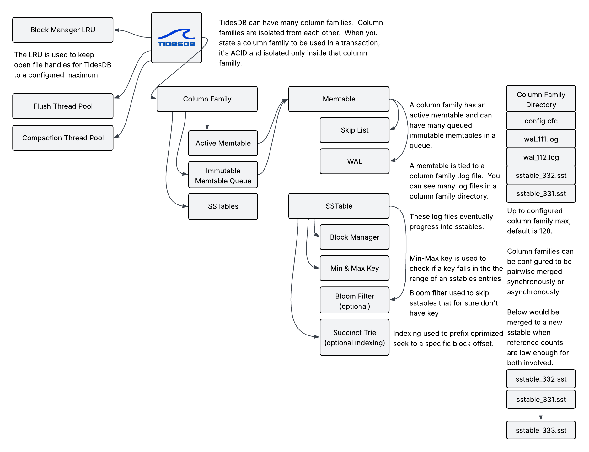
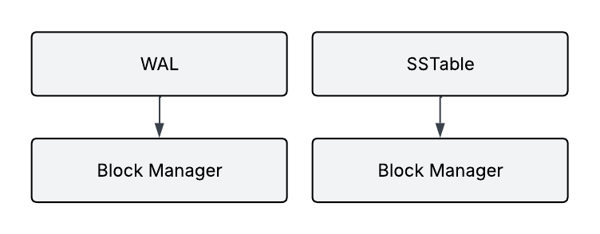
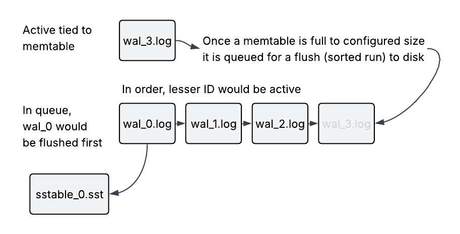
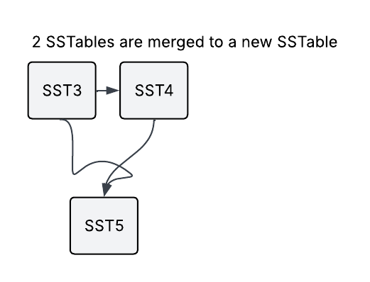

## 1. Introduction
Here we explore the inner workings of TidesDB, its architecture, core components, and operational mechanisms.

## 2. Theoretical Foundation
### 2.1 Origins and Concept
The Log-Structured Merge-tree was first introduced by Patrick O'Neil, Edward Cheng, Dieter Gawlick, and Elizabeth O'Neil in their 1996 paper. The fundamental insight of the LSM-tree is to optimize write operations by using a multi-tier storage structure that defers and batches disk writes.

### 2.2 Basic LSM-tree Structure
An LSM-tree typically consists of multiple components

- In-memory buffers (memtables) that accept writes
- Immutable on-disk files (SSTables are Sorted String Tables)
- Processes that merge SSTables to reduce storage overhead and improve read performance

This structure allows for efficient writes by initially storing data in memory and then periodically flushing to disk in larger batches, reducing the I/O overhead associated with random writes.


## 3. TidesDB Architecture

<div class="architecture-diagram">



</div>

### 3.1 Overview
TidesDB uses a two-tiered storage architecture: a memory level that stores 
recently written key-value pairs in sorted order using a skip list data 
structure which is associated with a write ahead log (WAL) that stores committed transactions, and a disk level containing multiple SSTables with an effective append only block layout. When reading data, 
newer tables take precedence over older ones, ensuring the most recent 
version of a key is always retrieved.

This design choice differs from other implementations like RocksDB and LevelDB, which use a multi-level approach with specific level-based compaction policies.

### 3.2 Column Families
A distinctive aspect of TidesDB is its organization around column families. Each column family
<div class="architecture-diagram">


</div>

- Operates as an independent key-value store
- Has its own dedicated memtable and set of SSTables
- Can be configured with different parameters for flush thresholds, compression settings, etc.
- Uses mutexes for flush and compaction coordination while skip list operations remain lock-free

This design allows for domain-specific optimization and isolation between different types of data stored in the same TidesDB instance.

## 4. Core Components and Mechanisms
### 4.1 Memtable
<div class="architecture-diagram">


</div>

The memtable is the first landing point for all column family write operations. TidesDB implements the memtable using a lock-free skip list with atomic operations and a versioning strategy for exceptional read performance. When a key is updated, a new version is prepended to the version list for that key, but reads always return the newest version (head of the list), implementing **last-write-wins** semantics. This allows concurrent reads and writes without blocking.

**Lock-Free Concurrency Model**

Readers never acquire locks, never block, and scale linearly with CPU cores. Writers perform lock-free atomic operations on the skip list structure using CAS (Compare-And-Swap) instructions. Readers don't block writers, and writers don't block readers. All read operations use atomic pointer loads with acquire memory ordering for correct synchronization. Flush and compaction operations use dedicated mutexes (`flush_lock` and `compaction_lock`) to serialize structural changes without blocking skip list operations.

**Memory Management**

- Skip list nodes are allocated individually using `malloc()` for each node
- Keys are always allocated separately and stored as pointers in nodes
- Values are allocated separately and stored in version structures
- Each key can have multiple versions linked in a list, with the newest version at the head
- Reads always return the newest version (last-write-wins semantics)
- Nodes are freed only when the entire skip list is destroyed (via `skip_list_free` or `skip_list_clear`)
- Memtables use atomic reference counting to prevent premature freeing during concurrent access

**Custom Comparators**

Each column family can register a custom key comparison function (memcmp, string, numeric, or user-defined) that determines sort order consistently across the entire system--memtable, SSTables, block indexes, and iterators all use the same comparison logic.  Once a comparator is registered, it cannot be changed for the duration of the column family's lifecycle.

**Configuration and Lifecycle**

The skip list's flush threshold (`memtable_flush_size`), maximum level, and probability parameters are configurable per column family. When the memtable reaches the size threshold, it becomes immutable and is queued for flushing while a new active memtable is created. The immutable memtable is flushed to disk as an SSTable by a background thread pool, with reference counting ensuring the memtable isn't freed until all readers complete and the flush finishes. Each memtable is paired with a WAL (Write-Ahead Log) for durability and recovery. When a memtable is in the flush queue and immutable it is still accessible for reading. Because the memtable has a WAL associated with it,you will see a WAL file (i.e., wal_4.log) file until the flush is complete. If a crash occurs the memtable's WAL is replayed and immutable state is recovered and requeued for flush.


### 4.2 Block Manager Format

The block manager is TidesDB's low-level storage abstraction that manages both WAL files and SSTable files. All persistent data is stored using the block manager format.
<div class="architecture-diagram">



</div>

#### File Structure

Every block manager file (WAL or SSTable) has the following structure

```
[File Header is 12 bytes]
[Block 0]
[Block 1]
[Block 2]
...
[Block N]
```

#### File Header (12 bytes)

| Offset | Size | Field | Description |
|--------|------|-------|-------------|
| 0 | 3 bytes | Magic | `0x544442` ("TDB" in hex) |
| 3 | 1 byte | Version | Block manager version (currently 4) |
| 4 | 4 bytes | Block Size | Default block size for this file |
| 8 | 4 bytes | Padding | Reserved for future use |


#### Block Format

Each block has the following structure

```
[Block Size is 8 bytes (uint64_t)]
[xxHash64 Checksum is 8 bytes]
[Inline Data is a variable, up to block_size]
[Overflow Offset is 8 bytes (uint64_t)]
[Overflow Data is a variable, if size > block_size]
```

**Block Header (24 bytes minimum)**

The block header consists of the block size (8 bytes) representing the total size of the data (inline + overflow), an xxHash64 checksum (8 bytes) for integrity checking the entire block data, inline data (variable) containing the first portion of data up to `block_size` bytes, and an overflow offset (8 bytes) pointing to overflow data (0 if no overflow).

**Overflow Handling**

If the data size is less than or equal to `block_size` (default 32KB), all data is stored inline with overflow offset set to 0. If the data size exceeds `block_size`, the first 32KB is stored inline and the remainder is placed at the overflow offset. Overflow data is written immediately after the main block, allowing efficient storage of both small and large blocks.

#### Block Write Process

The write process begins by computing the xxHash64 checksum of the entire data, determining the inline size (minimum of data size and block_size), and calculating the remaining overflow size. The main block buffer is built containing the block size (8 bytes), xxHash64 checksum (8 bytes), inline data (up to 32KB), and overflow offset (8 bytes, initially 0). The main block is written atomically using `pwrite()`. If overflow exists, the overflow data is written at the end of the file and the overflow offset in the main block is updated. Finally, fsync is optionally performed based on the sync mode.

#### Block Read Process

The read process reads the block size (8 bytes) and xxHash64 checksum (8 bytes), calculates the inline size, and reads the inline data. It then reads the overflow offset (8 bytes). If the overflow offset is greater than 0, it seeks to the overflow offset and reads the remaining data. The inline and overflow data are concatenated, the xxHash64 checksum is verified, and the block is returned if valid.

#### Integrity and Recovery

TidesDB implements multiple layers of data integrity protection. All block 
reads verify xxHash64 checksums to detect corruption, while writes use `pwrite()` 
for atomic block-level updates. During startup, the system validates the last 
block's integrity--if corruption is detected, the file is automatically 
truncated to the last known-good block. This approach ensures crash safety by 
guaranteeing that incomplete or corrupted writes are identified and cleaned up 
during recovery.

#### Cursor Operations

The block manager provides cursor-based sequential access for efficient data 
traversal. Cursors support forward iteration via `cursor_next()` and backward 
iteration through `cursor_prev()`, which scans from the beginning to locate 
the previous block. Random access is available through `cursor_goto(pos)`, 
allowing jumps to specific file offsets. Each cursor maintains its current 
position and block size, with boundary checking methods like `at_first()`, 
`at_last()`, `has_next()`, and `has_prev()` to prevent out-of-bounds access.

#### Sync Modes

TDB_SYNC_NONE provides the fastest performance with no explicit fsync, relying on the OS page cache. TDB_SYNC_FULL offers the most durability by performing fsync/fdatasync after every block write. The sync mode is configurable per column family and set internally for column family WAL and SSTable files.

#### Thread Safety

Block manager operations use a write mutex to serialize all write operations, preventing corruption. Concurrent reads are supported with multiple readers able to read simultaneously using `pread()`. All writes use `pwrite()` for atomic operations.

#### FIFO Block Cache

TidesDB implements an optional FIFO (First-In-First-Out) block cache at the block manager level to reduce disk I/O for frequently accessed data blocks. This cache is configurable per column family via the `block_manager_cache_size` setting.

**Cache Architecture**

The block cache uses a hash table combined with a FIFO queue for O(1) lookups and evictions. Each cached block is identified by a unique key derived from its file offset (e.g., "12345" for offset 12345). The hash table provides fast key-based lookups using xxHash for distribution, while the FIFO queue maintains insertion order (oldest at head, newest at tail). An eviction callback is registered for each cached block to update cache size tracking when blocks are evicted. All cache operations are protected by a mutex, ensuring safe concurrent access.

**Cache Operations**

After writing a block to disk, if cache space is available (current_size + block_size <= max_size), a copy of the block is added to the cache with the file offset as the key. If the cache is full, the FIFO eviction policy automatically removes the oldest block (first inserted) to make space. The cache size is tracked in bytes, with each block contributing its data size to the total.

Before reading from disk, the cache is checked using the block offset as the key. On cache hit, a copy of the cached block is returned immediately (no disk I/O). On cache miss, the block is read from disk, and if space permits, it's added to the cache for future reads. Unlike LRU, FIFO does not reorder blocks on access - the insertion order is preserved.

When the cache reaches `block_manager_cache_size`, the oldest block (head of FIFO queue) is automatically evicted. The eviction callback decrements `current_size` by the evicted block's size and frees the block's memory. This ensures the cache never exceeds the configured memory limit.

**Configuration Example**

```c
tidesdb_column_family_config_t cf_config = tidesdb_default_column_family_config();
cf_config.block_manager_cache_size = 32 * 1024 * 1024;  /* 32MB cache */
tidesdb_create_column_family(db, "my_cf", &cf_config);
```

**Performance Benefits**

- Hot blocks (frequently accessed) stay in memory, eliminating disk reads
- Cache hits provide sub-microsecond access vs milliseconds for disk I/O
- During compaction, recently written blocks are cached, speeding up merge operations
- Sequential scans benefit from cached blocks in the read path

**Cache Sizing Guidelines**

- Small datasets (<100MB): Set cache to 10-20% of dataset size
- Large datasets (>1GB): Set cache to 5-10% or based on working set size
- Read-heavy workloads: Larger cache (50-100MB+) provides better hit rates
- Write-heavy workloads: Smaller cache (10-20MB) since data is less frequently re-read
- Disable caching: Set `block_manager_cache_size = 0` to disable (no memory overhead)

**Monitoring Cache Effectiveness**

While TidesDB doesn't expose cache hit/miss metrics directly, you can infer effectiveness by monitoring I/O patterns (fewer disk reads indicate good cache performance) and adjusting cache size based on workload (increase if reads are slow, decrease if memory is constrained).


### 4.3 SSTables (Sorted String Tables)

SSTables serve as TidesDB's immutable on-disk storage layer. Internally, each 
SSTable is organized into multiple blocks containing sorted key-value pairs. 
To accelerate lookups, every SSTable maintains its minimum and maximum keys, 
allowing the system to quickly determine if a key might exist within it. 
Optional succinct trie indices provide direct access to specific blocks, 
eliminating the need to scan entire files. The immutable nature of SSTables--once 
written, they are never modified, only merged or deleted--ensures data consistency 
and enables lock-free concurrent reads.

**Reference Counting and Lifecycle**

SSTables use atomic reference counting to manage their lifecycle safely. When an 
SSTable is accessed (by a read operation, iterator, or compaction), its reference 
count is incremented. When the operation completes, the reference is released. 
Only when the reference count reaches zero is the SSTable actually freed from 
memory. This prevents use-after-free bugs during concurrent operations like 
compaction (which may delete SSTables) and reads (which may still be accessing them).

**Block Manager Caching**

The underlying block manager file handles are cached in a storage-engine-level FIFO cache 
with a configurable capacity (`max_open_file_handles`). When an SSTable is opened, 
its block manager is added to the cache. If the cache is full, the oldest 
block manager (first opened) is automatically closed. This prevents file descriptor exhaustion 
while maintaining good performance for frequently accessed SSTables.

#### SSTable Block Layout

SSTables use the block manager format with sequential block ordering:

```
[File Header - 12 bytes Block Manager Header]
[Block 0: KV Pair 1]
[Block 1: KV Pair 2]
[Block 2: KV Pair 3]
...
[Block N-1: KV Pair N]
[Bloom Filter Block] (optional)
[Index Block] (optional)
[Metadata Block] (always last)
```

**Block Order (from first to last)**
1. Data Blocks: Key-value pairs in sorted order (sequential blocks starting at 0)
2. Bloom Filter Block (optional): Only written if `enable_bloom_filter = 1`
3. Index Block (optional): Only written if `enable_block_indexes = 1`
4. Metadata Block (required): Always the last block in the file

:::note
The exact block positions of bloom filter and index depend on how many KV pairs exist and which features are enabled. During SSTable loading, the system reads backwards from the end: metadata (last), then index (if present), then bloom filter (if present).
:::

#### Data Block Format (KV Pairs)

Each data block contains a single key-value pair

```
[KV Header is 26 bytes (packed)]
[Key is variable]
[Value is variable]
```

**KV Pair Header (26 bytes, packed)**
```c
typedef struct __attribute__((packed)) {
    uint8_t version;        // Format version (currently 4)
    uint8_t flags;          // TDB_KV_FLAG_TOMBSTONE (0x01) for deletes
    uint32_t key_size;      // Key size in bytes
    uint32_t value_size;    // Value size in bytes
    int64_t ttl;            // Unix timestamp for expiration (0 = no expiration)
    uint64_t seq;           // Sequence number for ordering and MVCC
} tidesdb_kv_pair_header_t;
```

**Compression**
- If `enable_compression = 1` in column family config, entire block is compressed
- Compression applied to [Header + Key + Value] as a unit
- Supports Snappy, LZ4, or ZSTD algorithms (configured via `compression_algorithm`)
- Decompression happens on read before parsing header
- Default is enabled with LZ4 algorithm

#### Bloom Filter Block

<div class="architecture-diagram">


</div>

Written after all data blocks (if enabled)
- Serialized bloom filter data structure
- Used to quickly determine if a key might exist in the SSTable
- Avoids unnecessary disk I/O for non-existent keys
- False positive rate configurable per column family (default 1%)
- Only written if `enable_bloom_filter = 1` in column family config
- Loaded third-to-last when reading backwards during SSTable recovery

#### Index Block (Succinct Trie)

<div class="architecture-diagram">


</div>

TidesDB implements a space-efficient succinct trie using LOUDS (Level-Order Unary Degree Sequence) encoding to provide fast key-to-block-number lookups in SSTables. The data structure consists of five compact arrays that work in concert: a LOUDS bitvector that encodes the tree structure using approximately 2 bits per node, where sequences of 1-bits represent children and 0-bits mark boundaries; a labels array storing the character for each edge in breadth-first order; an edge_child array mapping each edge index to its corresponding child node ID; a terminal bitvector marking which nodes represent complete keys; and a values array holding the actual block numbers (0-indexed sequential positions) for terminal nodes. During lookup, the trie navigates from the root by using rank and select operations on the LOUDS bitvector to locate children, comparing characters in the labels array, and following the edge_child mappings until reaching a terminal node, at which point it returns the corresponding block number. The implementation features a disk-streaming builder that maintains O(1) memory usage during construction by writing intermediate data to temporary block manager files, making it capable of building indices for arbitrarily large datasets without memory constraints. This approach achieves 95% space savings compared to pointer-based tries while maintaining O(key_length) lookup time, and the entire structure can be serialized directly into SSTable files for persistent storage, enabling TidesDB to perform direct block access (by advancing the cursor to the returned block number) instead of expensive linear scans through data blocks.

#### Metadata Block

Always written as the last block in the file

```
[Magic is 4 bytes (0x5353544D = "SSTM")]
[Num Entries is 8 bytes (uint64_t)]
[Min Key Size is 4 bytes (uint32_t)]
[Min Key is variable]
[Max Key Size is 4 bytes (uint32_t)]
[Max Key is variable]
```

**Purpose**
- Magic number (0x5353544D = "SSTM") identifies this as a valid SSTable metadata block
- Min/max keys enable range-based SSTable filtering during reads
- Num entries tracks total KV pairs in SSTable (used to know when to stop reading data blocks)
- Always loaded first during SSTable recovery using `cursor_goto_last()` to read from end of file

#### SSTable Write Process

1. Create SSTable file and initialize bloom filter and succinct trie builder (if enabled)
2. Iterate through memtable in sorted order using skip list cursor
3. **For each KV pair**
   - Build KV header (26 bytes) + key + value
   - Optionally compress the entire block
   - Write as data block and record the block number (0-indexed sequential counter)
   - Add key to bloom filter (if enabled)
   - Add key->block_number mapping to succinct trie builder (if enabled)
   - Track min/max keys
4. Build the succinct trie from the builder (if enabled)
5. Serialize and write bloom filter block (if enabled)
6. Serialize and write succinct trie index block (if enabled)
7. Build and write metadata block with magic number, entry count, and min/max keys

#### SSTable Read Process

1. **Load SSTable** (recovery)
   - Open block manager file
   - Use `cursor_goto_last()` to seek to last block
   - Read and parse metadata block (validates magic number 0x5353544D)
   - Extract num_entries, min_key, and max_key from metadata
   - Use `cursor_prev()` to read previous block (index, if present)
   - Deserialize succinct trie index (if data is valid)
   - Use `cursor_prev()` to read previous block (bloom filter, if present)
   - Deserialize bloom filter (if data is valid)

2. **Lookup Key**
   - Check if key is within min/max range (quick rejection)
   - Check bloom filter if enabled (probabilistic rejection)
   - If block indexes enabled: query succinct trie for block number (0-indexed)
     - Position cursor at first block, then advance to target block number
     - Read block at that position
   - If block indexes disabled: linear scan through data blocks
   - Decompress block if compression is enabled
   - Parse KV header (26 bytes) and extract key/value
   - Check TTL expiration
   - Return value or tombstone marker

SSTables are read from engine level FIFO cache.
<div class="architecture-diagram">


</div>

### 4.4 Write-Ahead Log (WAL)
For durability, TidesDB implements a write-ahead logging mechanism with a rotating WAL system tied to memtable lifecycle.

#### 4.4.1 WAL File Naming and Lifecycle
<div class="architecture-diagram">

   
   
</div>

File Format: `wal_<memtable_id>.log`

WAL files follow the naming pattern `wal_0.log`, `wal_1.log`, `wal_2.log`, etc. Each memtable has its own dedicated WAL file, with the WAL ID matching the memtable ID (a monotonically increasing counter). Multiple WAL files can exist simultaneously - one for the active memtable and others for memtables in the flush queue. WAL files are deleted only after the memtable is successfully flushed to an SSTable and freed.

#### 4.4.2 WAL Rotation Process

<div class="architecture-diagram">

   

</div>

TidesDB uses a rotating WAL system that works as follows:

Initially, the active memtable (ID 0) uses `wal_0.log`. When the memtable size reaches `memtable_flush_size`, rotation is triggered. During rotation, a new active memtable (ID 1) is created with `wal_1.log`, while the immutable memtable (ID 0) with `wal_0.log` is added to the immutable memtables queue. A flush task is submitted to the flush thread pool. The background flush thread writes memtable (ID 0) to `sstable_0.sst` while `wal_0.log` still exists. Once the flush completes successfully, the memtable is dequeued from the immutable queue, its reference count drops to zero, and both the memtable and `wal_0.log` are freed/deleted. Multiple memtables can be in the flush queue concurrently, each with its own WAL file and reference count.

#### 4.4.3 WAL Features and Sequence Numbers

All writes (including deletes/tombstones) are first recorded in the WAL before being applied to the memtable. Each column family maintains its own independent WAL files, and automatic recovery on startup reconstructs memtables from WALs. WAL entries are stored **uncompressed** for fast writes and recovery.

**Sequence Numbers for Ordering**

Each WAL entry is assigned a monotonically increasing sequence number via `atomic_fetch_add(&cf->next_wal_seq, 1)`. This provides lock-free ordering guarantees:

- Multiple transactions can commit concurrently without locks
- Each operation gets a unique sequence number atomically
- Sequence numbers ensure deterministic ordering even with concurrent writes
- During WAL recovery, entries are sorted by sequence number before replay
- This guarantees last-write-wins consistency is preserved across crashes

The sequence number is stored in the 26-byte KV header (8 bytes at offset 18) and used during recovery to replay operations in the correct order, ensuring the memtable state matches the commit order regardless of how WAL entries were physically written to disk.

#### 4.4.4 Recovery Process

On startup, TidesDB automatically recovers from WAL files:

The system scans the column family directory for `wal_*.log` files and sorts them by ID (oldest to newest). It then replays each WAL file into a new memtable, reconstructing the in-memory state from persisted WAL entries before continuing normal operation with the recovered data.

**What Gets Recovered**

All committed transactions that were written to WAL are recovered. During recovery:

1. WAL entries are read from disk
2. Entries are collected with their sequence numbers
3. Entries are **sorted by sequence number** (insertion sort)
4. Entries are replayed in sequence order into the memtable
5. This ensures last-write-wins consistency is preserved

Uncommitted transactions are discarded (as they're not in the WAL). The sequence number sorting ensures that even if concurrent writes caused WAL entries to be physically written out of order, they are replayed in the correct logical order.

**SSTable Recovery Ordering**

SSTables are discovered by reading the column family directory, where directory order is filesystem-dependent and non-deterministic. SSTables are sorted by ID after loading to ensure correct read semantics, guaranteeing newest-to-oldest ordering for the read path (which searches from the end of the array backwards). Without sorting, stale data could be returned if newer SSTables load before older ones.

#### 4.4.5 WAL Recovery Configuration

TidesDB provides two recovery modes that control how `tidesdb_open()` handles WAL recovery, allowing you to balance startup speed against data availability guarantees.

**Fast Startup Mode (Default)**

By default, `tidesdb_open()` returns immediately after submitting recovered memtables to the background flush thread pool:

```c
tidesdb_config_t config = {
    .db_path = "./tidesdb",
    .wait_for_wal_recovery = 0  /* Default is false */
};
```

- Fastest startup time - `tidesdb_open()` returns immediately
- Recovered WAL data is flushed to SSTables asynchronously in background
- Queries may temporarily return "key not found" until flushes complete
- Good for web servers, caching layers, read-heavy workloads, eventual consistency acceptable

**Guaranteed Availability Mode**

When enabled, `tidesdb_open()` blocks until all recovered memtables have been flushed to SSTables

```c
tidesdb_config_t config = {
    .db_path = "./mydb",
    .wait_for_wal_recovery = 1,           /* Wait for recovery */
    .wal_recovery_poll_interval_ms = 100  /* Poll every 100ms (default) */
};
```

- All recovered data immediately queryable after `tidesdb_open()` returns
- Blocks until flush queue is empty and stable (checked twice with delay)
- Slower startup proportional to WAL size and number of recovered memtables
- Good for Financial systems, audit logs, healthcare records, strict consistency requirements

**Implementation Details**

The recovery wait mechanism uses a stability check to ensure flushes have truly completed. The immutable memtable queue must be empty for two consecutive polling intervals before recovery is considered complete. This prevents race conditions where a memtable is temporarily dequeued but not yet submitted to the flush pool.

## 5. Data Operations

### 5.1 Write Path
When a key-value pair is written to TidesDB (via `tidesdb_txn_commit()`):

1. **Acquire active memtable** - Lock-free CAS retry loop to safely acquire a reference to the current active memtable
2. **Assign sequence number** - Atomically increment the WAL sequence counter via `atomic_fetch_add()`
3. **Write to WAL** - Record the operation in the active memtable's WAL using lock-free block manager write
4. **Write to skip list** - Insert the key-value pair into the skip list using lock-free atomic CAS operations
5. **Check flush threshold** - If memtable size exceeds `memtable_flush_size`, attempt to acquire `flush_lock` via `trylock`
6. **Trigger rotation** (if lock acquired and size still exceeds threshold):
   - Create a new active memtable with a new WAL file
   - Atomically swap the active memtable pointer
   - Add the immutable memtable to the flush queue
   - Submit flush task to the flush thread pool
   - Release `flush_lock`
7. **Background flush** - Flush thread writes immutable memtable to SSTable, then deletes WAL and frees memtable
8. **Concurrent writes** - Multiple transactions can write concurrently without blocking (lock-free)


### 5.2 Read Path

When reading a key from TidesDB:

1. **Check active memtable** for the key
2. **Check immutable memtables** in the flush queue (newest to oldest)
3. **Check SSTables** in reverse chronological order (newest to oldest)
   - For each SSTable, perform the lookup process described in Section 4.3 (min/max range check, bloom filter, block index or linear scan, decompression, TTL/tombstone validation)
4. Return the value when found, or `TDB_ERR_NOT_FOUND` if not present in any source

This multi-tier search ensures the most recent version of a key is always retrieved, with newer sources taking precedence over older ones.

### 5.3 Transactions

TidesDB provides transaction support with multi-column-family capabilities. 
Transactions are initiated through `tidesdb_txn_begin()` for writes or 
`tidesdb_txn_begin_read()` for read-only operations, with a single transaction 
capable of operating across multiple column families. The system implements 
**READ COMMITTED** isolation for point reads (`tidesdb_txn_get`), where reads 
see the latest committed data, and **snapshot isolation** for iterators 
(`tidesdb_iter_new`), where iterators see a consistent point-in-time view via 
atomic reference counting on both memtables and SSTables.

**Lock-Free Write Path**

Write transactions use a completely lock-free commit path with atomic operations:

1. Transaction operations are buffered in memory during `tidesdb_txn_put()` and `tidesdb_txn_delete()`
2. On `tidesdb_txn_commit()`, each operation is written to WAL and skip list using lock-free atomic CAS
3. Sequence numbers are assigned atomically via `atomic_fetch_add()` for ordering
4. Memtable references are acquired using lock-free CAS retry loops
5. No locks are held during commit - multiple transactions can commit concurrently

**Isolation Guarantees**

Read transactions don't block writers and writers don't block readers. Transactions 
support read-your-own-writes semantics, allowing uncommitted changes to be read 
before commit. The API uses simple integer return codes (0 for success, negative 
for errors) rather than complex error structures.

### 6. Compaction Policy

TidesDB implements two distinct compaction techniques


<div class="architecture-diagram">


</div>

### 6.1 Parallel Compaction

TidesDB implements parallel compaction using semaphore-based thread limiting to 
reduce SSTable count, remove tombstones, and purge expired TTL entries. The 
number of concurrent threads is configurable via `compaction_threads` in the 
column family config (default 2). Compaction pairs SSTables from oldest to 
newest (pairs 0+1, 2+3, 4+5, etc.), with each thread processing one pair. A 
semaphore limits concurrent threads to the configured maximum. When 
`compaction_threads >= 2`, `tidesdb_compact()` automatically uses parallel 
execution. At least 2 SSTables are required to trigger compaction. The process 
approximately halves the SSTable count per run.

### 6.2 Background Compaction

Background compaction provides automatic, hands-free SSTable management. 
Enabled via `enable_background_compaction = 1` in the column family 
configuration, it automatically triggers when the SSTable count reaches 
`max_sstables_before_compaction`. When a flush completes and the SSTable count 
exceeds the threshold, a compaction task is submitted to the engine-level 
compaction thread pool. This operates independently without blocking application 
operations, merging SSTable pairs throughout the storage engine lifecycle 
until shutdown. The interval between compaction checks is configurable via 
`background_compaction_interval` (default 1 second).

### 6.3 Compaction Mechanics

<div class="architecture-diagram">



</div>

During compaction, SSTables are paired (typically oldest with second-oldest) and merged into new SSTables. For each key, only the newest version is retained, while tombstones (deletion markers) and expired TTL entries are purged. Original SSTables are deleted after a successful merge.

#### Atomic Rename Strategy

TidesDB uses a temporary file pattern with atomic rename to ensure crash safety during compaction. When merging two SSTables (e.g., `sstable_0.sst` and `sstable_1.sst`), the new merged SSTable is first written to a temporary file with the `.tmp` extension (e.g., `sstable_2.sst.tmp`). This temporary file is fully written with all data blocks, bloom filter, index, and metadata before any filesystem-level commit occurs. Once the temporary file is complete and all data is flushed to disk, TidesDB performs an atomic `rename()` operation from `sstable_2.sst.tmp` to `sstable_2.sst`. This rename is atomic at the filesystem level on both POSIX and Windows, meaning it either fully succeeds or fully fails with no intermediate state visible to readers.

**Crash Recovery**

If a crash occurs during compaction before the rename, the temporary `.tmp` file is left on disk while the original SSTables remain intact and valid. On the next startup, TidesDB automatically scans the database directory and deletes any `.tmp` files found, cleaning up incomplete compaction attempts. The original SSTables are still present and readable, so no data is lost. If a crash occurs after the rename completes, the new merged SSTable is already committed and the original SSTables are deleted during the normal compaction cleanup phase.

This approach provides several critical guarantees. Readers never see partially written SSTables since the `.tmp` file remains invisible until the atomic rename completes, ensuring crash safety throughout the merge process. The rename operation itself is atomic at the filesystem level, preventing corruption from incomplete writes and guaranteeing that the SSTable either fully exists or doesn't exist at all. Orphaned `.tmp` files from interrupted compactions are automatically cleaned up on startup, requiring no manual intervention. Most importantly, no data is ever lost--the original SSTables remain valid and readable until the merge is fully committed and the new SSTable is atomically visible to readers.

## 7. Performance Optimizations
### 7.1 Block Indices

TidesDB employs block indices to optimize read performance. Each SSTable contains an optional final block with a succinct trie block index, which allows direct access to the block containing a specific key or key prefix and significantly reduces I/O by avoiding full SSTable scans.

### 7.2 Compression

TidesDB supports multiple compression algorithms for SSTable data: Snappy emphasizes speed over compression ratio, LZ4 provides a balanced approach with good speed and reasonable compression, and ZSTD offers a higher compression ratio at the cost of some performance. Compression is applied only to SSTable entries (data blocks) to reduce disk usage and I/O. WAL entries remain uncompressed for fast writes and recovery.

### 7.3 Sync Modes

TidesDB provides two sync modes to balance durability and performance. TDB_SYNC_NONE is fastest but least durable, relying on the OS to handle flushing to disk via page cache. TDB_SYNC_FULL is most durable, performing fsync on every write operation. The sync mode can be configured per column family, allowing different durability guarantees for different data types.

### 7.4 Configurable Parameters

TidesDB allows fine-tuning through various configurable parameters including memtable flush thresholds, skip list configuration (max level and probability), bloom filter usage and false positive rate, compression settings (algorithm selection), compaction trigger thresholds and thread count, sync mode (TDB_SYNC_NONE or TDB_SYNC_FULL), debug logging, succinct trie block index usage, and thread pool sizes (flush and compaction).

### 7.5 Thread Pool Architecture

For efficient resource management, TidesDB employs shared thread pools at the 
storage engine level. Rather than maintaining separate pools per column family, all 
column families share common flush and compaction thread pools configured 
during the TidesDB instance initialization. Operations are submitted as tasks to these 
pools, enabling non-blocking execution--application threads can continue 
processing while flush and compaction work proceeds in the background. This 
architecture minimizes resource overhead and provides consistent, predictable 
performance across the entire storage engine instance.

**Configuration**
```c
tidesdb_config_t config = {
    .db_path = "./mydb",
    .num_flush_threads = 4,      /* 4 threads for flush operations */
    .num_compaction_threads = 8  /* 8 threads for compaction */
};
```

**Thread Pool Implementation**

Each thread pool consists of worker threads that wait on a task queue. When a 
task is submitted (flush or compaction), it's added to the appropriate queue 
and a worker thread picks it up. The flush pool handles memtable-to-SSTable 
flush operations, while the compaction pool handles SSTable merge operations. 
Worker threads use `queue_dequeue_wait()` to block efficiently when no tasks 
are available, waking immediately when work arrives.

**Benefits**

One set of threads serves all column families providing resource efficiency, with better thread utilization across workloads. Configuration is simpler since it's set once at the storage engine level, and the system is easily scalable to tune for available CPU cores. The queue-based design prevents thread creation overhead and enables graceful shutdown.

**Default values**

The `num_flush_threads` defaults to 2 (TDB_DEFAULT_THREAD_POOL_SIZE) and is I/O bound, so 2-4 is usually sufficient. The `num_compaction_threads` also defaults to 2 (TDB_DEFAULT_THREAD_POOL_SIZE) but is CPU bound, so it can be set higher (4-16).

## 8. Concurrency and Thread Safety

TidesDB is designed for exceptional concurrency with lock-free skip list operations and mutex-based coordination for structural changes.

### 8.1 Lock-Free Skip List Operations

TidesDB's skip list memtables use lock-free operations with atomic CAS instructions 
and a versioning strategy with last-write-wins semantics. Readers never acquire locks, 
never block, and scale linearly with CPU cores. All read operations use atomic pointer 
loads with acquire memory ordering for correct synchronization. Writers perform lock-free 
atomic operations on the skip list structure using Compare-And-Swap (CAS) instructions. 
Readers don't block writers, and writers don't block readers. Nodes are only freed when 
the entire skip list is destroyed, preventing use-after-free during concurrent access.

### 8.2 Column Family Coordination

Each column family uses dedicated mutexes for coordinating structural operations:

- `flush_lock` - Serializes memtable rotation and flush queue operations
- `compaction_lock` - Serializes SSTable array modifications during compaction
- `cf_lock` - Reader-writer lock for column family lifecycle operations (create/drop)

These mutexes coordinate structural changes without blocking lock-free skip list 
operations. Multiple threads can read and write to the skip list concurrently while 
flush and compaction operations safely modify the underlying storage structures.

### 8.3 Transaction Isolation

TidesDB implements **READ COMMITTED** isolation for point reads and **snapshot 
isolation** for iterators, both with read-your-own-writes semantics. Point 
reads (`tidesdb_txn_get`) see the latest committed data from all sources 
(active memtable, immutable memtables, SSTables). Iterators 
(`tidesdb_iter_new`) acquire atomic references on both memtables and SSTables, 
creating a consistent point-in-time snapshot unaffected by concurrent 
compaction or writes.

**Lock-Free Transaction Commits**

Both read and write transactions use lock-free atomic operations throughout their 
lifecycle. Write transactions do NOT acquire locks during commit - instead, they 
use atomic CAS operations to safely write to WAL and skip list. Multiple write 
transactions can commit concurrently without blocking each other. Within a single 
transaction, uncommitted changes are immediately visible (read-your-own-writes), 
allowing operations to read their own writes before commit.

### 8.4 Optimal Use Cases

This concurrency model makes TidesDB particularly well-suited for:

- Read-heavy workloads with unlimited concurrent readers and no contention
- Mixed read/write workloads where readers never wait for writers to complete
- Multi-column-family applications where different column families can be written to concurrently

## 9. Directory Structure and File Organization

TidesDB organizes data on disk with a clear directory hierarchy. Understanding this structure is essential for backup, monitoring, and debugging.

### 9.1 Directory Layout

Each TidesDB instance has a root directory containing subdirectories for each column family

```
mydb/
├── my_cf/
│   ├── config.cfc        
│   ├── wal_1.log
│   ├── sstable_0.sst
│   ├── sstable_1.sst
│   └── sstable_2.sst
├── users/
│   ├── config.cfc
│   ├── wal_0.log
│   └── sstable_0.sst
└── sessions/
    ├── config.cfc
    └── wal_0.log
```

.cfc files are in INI format and contain the column family configuration.

### 9.2 File Naming Conventions

#### Write-Ahead Log (WAL) Files

WAL files follow the naming pattern `wal_<memtable_id>.log` (e.g., `wal_0.log`, `wal_1.log`). Each memtable has its own dedicated WAL file with a matching ID. WAL files are deleted only after the corresponding memtable is successfully flushed to an SSTable. See Section 4.4 for detailed WAL lifecycle and rotation mechanics.

#### SSTable Files

SSTable files follow the naming convention `sstable_<sstable_id>.sst` (e.g., 
`sstable_0.sst`, `sstable_1.sst`) and provide persistent storage for flushed 
memtables. An SSTable is created when a memtable exceeds the 
`memtable_flush_size` threshold, with IDs assigned using a monotonically 
increasing counter per column family. Each SSTable contains sorted key-value 
pairs along with bloom filter and index metadata for efficient lookups. During 
compaction, old SSTables are merged into new consolidated files, and the 
original SSTables are deleted after the merge completes successfully.

### 9.3 WAL Rotation and Memtable Lifecycle Example

This example demonstrates how WAL files are created, rotated, and deleted

**1. Initial State**
```
Active Memtable (ID 0) → wal_0.log
```

**2. Memtable Fills Up** (size >= `memtable_flush_size`)
```
Active Memtable (ID 0) → wal_0.log  [FULL - triggers rotation]
```

**3. Rotation Occurs**
```
New Active Memtable (ID 1) → wal_1.log  [new WAL created]
Immutable Memtable (ID 0) → wal_0.log  [queued for flush]
```

**4. Background Flush (Async)**
```
Active Memtable (ID 1) → wal_1.log
Flushing Memtable (ID 0) → sstable_0.sst  [writing to disk]
wal_0.log  [still exists - flush in progress]
```

**5. Flush Complete**
```
Active Memtable (ID 1) → wal_1.log
sstable_0.sst  [persisted]
wal_0.log  [DELETED - memtable freed after flush]
```

**6. Next Rotation (Before Previous Flush Completes)**
```
New Active Memtable (ID 2) → wal_2.log  [new active]
Immutable Memtable (ID 1) → wal_1.log  [queued for flush]
Flushing Memtable (ID 0) → sstable_0.sst  [still flushing]
wal_0.log  [still exists - flush not complete]
```

**7. After All Flushes Complete**
```
Active Memtable (ID 2) → wal_2.log
SSTable sstable_0.sst
SSTable sstable_1.sst
wal_0.log, wal_1.log  [DELETED means both flushes complete]
```

### 9.4 Directory Management

Creating a column family creates a new subdirectory:
```c
tidesdb_create_column_family(db, "my_cf", &cf_config);
// Creates mydb/my_cf/ directory with
//   - initial wal_0.log (for active memtable)
//   - config.cfc (persisted configuration)
```

Dropping a column family removes the entire subdirectory:
```c
tidesdb_drop_column_family(db, "my_cf");
// Deletes mydb/my_cf/ directory and all contents (WALs, SSTables)
```

### 9.5 Monitoring Disk Usage

Useful commands for monitoring TidesDB storage

```bash
# Check total size
du -sh mydb/

# Check per-column-family size
du -sh mydb/*/

# Count WAL files (should be 1-2 per CF normally)
find mydb/ -name "wal_*.log" | wc -l

# Count SSTable files
find mydb/ -name "sstable_*.sst" | wc -l

# List largest SSTables
find mydb/ -name "sstable_*.sst" -exec ls -lh {} \; | sort -k5 -hr | head -10
```

### 9.6 Best Practices

**Disk Space Monitoring**

Monitor WAL file count, which is typically 1-3 per column family (1 active + 1-2 in flush queue). Many WAL files (>5) may indicate a flush backlog, slow I/O, or configuration issue. Monitor SSTable count as it triggers compaction at `max_sstables_before_compaction`. Set appropriate `memtable_flush_size` based on write patterns and flush speed.

**Backup Strategy**
```bash
# Stop writes, flush all memtables, then backup
# In your application
tidesdb_flush_memtable(cf);  # Force flush before backup

# Then backup
tar -czf mydb_backup.tar.gz mydb/
```

**Performance Tuning**

Larger `memtable_flush_size` results in fewer, larger SSTables with less compaction, while smaller `memtable_flush_size` creates more, smaller SSTables with more compaction. Adjust `max_sstables_before_compaction` based on your read/write ratio, and use `enable_background_compaction` for automatic maintenance.

## 10. Error Handling

TidesDB uses simple integer return codes for error handling. A return value of `0` (TDB_SUCCESS) indicates a successful operation, while negative values indicate specific error conditions. Error codes include memory allocation failures, I/O errors, corruption detection, lock failures, and more, allowing for precise error handling in production systems.

For a complete list of error codes and their meanings, see the [Error Codes Reference](../../reference/error-codes).

## 11. Memory Management
TidesDB validates key-value pair sizes to prevent out-of-memory conditions. If a key-value pair exceeds `TDB_MEMORY_PERCENTAGE` (60% of available system memory), TidesDB returns a `TDB_ERR_MEMORY_LIMIT` error. However, a minimum threshold of `TDB_MIN_KEY_VALUE_SIZE` (1MB) is enforced, ensuring that even on systems with low available memory, key-value pairs up to 1MB are always allowed. This prevents premature errors on 32-bit systems or memory-constrained environments. On startup, TidesDB populates `available_memory` and `total_memory` internally, which are members of the `tidesdb_t` struct, and uses these values to calculate the maximum allowed key-value size as `max(available_memory * 0.6, 1MB)`.  

## 12. Cross-Platform Portability

TidesDB is designed for maximum portability across operating systems, architectures, and compilers. All platform-specific code is isolated in `compat.h`, providing a unified abstraction layer that enables TidesDB to run identically on diverse platforms.

### 12.1 Supported Platforms

TidesDB officially supports and is continuously tested on:

**Operating Systems**
- Linux (Ubuntu, Debian, RHEL, etc.)
- macOS (Intel and Apple Silicon)
- Windows (MSVC and MinGW)

**Architectures**
- x86 (32-bit)
- x64 (64-bit)
- ARM (32-bit and 64-bit)
- RISC-V (experimental)

**Compilers**
- GCC (Linux, MinGW)
- Clang (macOS, Linux)
- MSVC (Windows)

### 12.2 Platform Abstraction Layer

The `compat.h` header provides cross-platform abstractions for system-specific functionality:

**File System Operations**
- `PATH_SEPARATOR` Platform-specific path separator (`\` on Windows, `/` on POSIX)
- `mkdir()` Unified directory creation (handles different signatures on Windows vs POSIX)
- `pread()`/`pwrite()` Atomic positioned I/O (implemented via OVERLAPPED on Windows)
- `fsync()`/`fdatasync()` Data synchronization (uses `FlushFileBuffers()` on Windows)

**Threading Primitives**
- `pthread_*` POSIX threads (native on Linux/macOS, pthreads-win32 on MSVC, native on MinGW)
- `sem_t` Semaphores (native POSIX on Linux, `dispatch_semaphore_t` on macOS, Windows semaphores on MSVC/MinGW)
- Atomic operations: C11 `stdatomic.h` on modern compilers, Windows Interlocked functions on older MSVC

**Time Functions**
- `clock_gettime()` High-resolution time (implemented via `GetSystemTimeAsFileTime()` on Windows)
- `tdb_localtime()` Thread-safe time conversion (handles `localtime_r` vs `localtime_s` parameter order differences)

**String and Memory**
- `tdb_strdup()` String duplication (`_strdup` on MSVC, `strdup` on POSIX)
- `SIZE_MAX` Maximum size_t value (fallback `((size_t)-1)` for older compilers)

**Compiler-Specific Optimizations**
- `PREFETCH_READ()`/`PREFETCH_WRITE()` CPU cache prefetch hints (`__builtin_prefetch` on GCC/Clang, `_mm_prefetch` on MSVC)
- `ATOMIC_ALIGN(n)` Atomic variable alignment (`__declspec(align(n))` on MSVC, `__attribute__((aligned(n)))` on GCC/Clang)
- `UNUSED` Unused variable attribute for static functions

### 12.3 Endianness and File Portability

All multi-byte integers use explicit little-endian encoding throughout TidesDB via `encode_uint32_le()`, `encode_uint64_le()`, `encode_int64_le()`, and corresponding decode functions. These functions perform bit-shifting and masking to ensure consistent byte order regardless of the host architecture's native endianness. This guarantees that database files are fully portable-files created on a big-endian ARM system can be copied to a little-endian x86 system and read without any conversion or compatibility issues. The same database files work identically across x86, ARM, RISC-V, 32-bit, 64-bit, little-endian, and big-endian systems.

### 12.4 Continuous Integration Testing

TidesDB uses GitHub Actions to continuously test all supported platforms on every commit

- Linux x64 and x86 · Native builds with GCC
- macOS x64 and x86 · Native builds with Clang (Intel and Rosetta 2)
- Windows MSVC x64 and x86 · Native builds with Microsoft Visual C++
- Windows MinGW x64 and x86 · Cross-platform builds with GCC on Windows

Additionally, a portability test creates a database on Linux x64 and verifies it can be read correctly on all other platforms (Windows MSVC/MinGW x86/x64, macOS x86/x64, Linux x86), ensuring true cross-platform file compatibility.

### 12.5 Build System

TidesDB uses CMake for cross-platform builds with platform-specific dependency management.
- Linux/macOS · System package managers (apt, brew) for compression libraries (zstd, lz4, snappy)
- Windows · vcpkg for dependency management

### 13. Testing and Quality Assurance

TidesDB maintains rigorous quality standards through comprehensive testing. The test suite includes over 200 individual test cases covering all components - block manager, skip list, bloom filters, succinct tries, FIFO cache, queue, compression, and end-to-end database operations. Tests run on every commit across 8 platform configurations (Linux/macOS/Windows × x86/x64 × GCC/Clang/MSVC/MinGW) with Address Sanitizer and Undefined Behavior Sanitizer enabled on Linux and macOS to detect memory errors and race conditions. The suite validates functional correctness (CRUD operations, transactions, iterators, compaction), concurrency safety (lock-free reads and writes, parallel compaction, no deadlocks), crash recovery (WAL replay, corruption detection, reference counting), and edge cases (NULL pointers, zero-length keys, overflow blocks, corrupted data). A dedicated portability test creates a database on Linux x64 and verifies it reads correctly on all other platforms, ensuring true cross-platform file compatibility. This testing strategy achieves near 100% coverage of critical paths including memtable operations, SSTable management, WAL recovery, compaction, and transaction semantics, ensuring TidesDB is highly reliable and correct.

